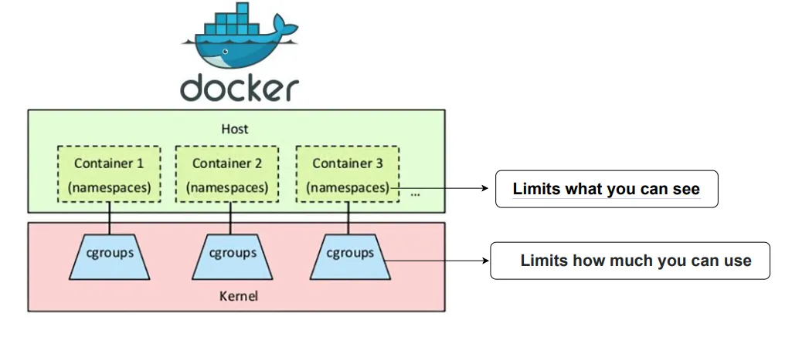

## 컨테이너란?
컨테이너란 애플리케이션과 그 종속성을 격리된 환경에서 실행하기 위한 리눅스 커널 기술이다. 컨테이너를 통해 여러 애플리케이션이 동일한 호스트에서 독립적으로 실행될 수 있다.

### 컨테이너의 등장 이전, 개발자들이 겪던 어려움
1. 환경 일관성 문제
  - 개발 환경, 테스트 환경, 운영 환경이 다를 경우 애플리케이션이 제대로 작동하지 않는 문제가 발생하였다.
  - 개발자간의 환경 불일치가 발생하면 각자 어떻게든 해결했어야 했다.
  - 배포하고 운영하는 상황에서도 여러 버그가 발생하였다.
  - (이 문제를 docker가 해결하면서 아래와 같은 docker meme이 생기게 되었다고 한다)
  - 
2. 애플리케이션 간의 격리
  - 여러 애플리케이션이 동일한 운영 체제에서 실행될 때 충돌이 발생하였다.
  - 각 애플리케이션 별로 특정 자바 버전을 필요로 하는 경우를 예시로 들 수 있다.

### 컨테이너의 등장
컨테이너는 개발 및 배포 과정의 효율성, 환경 일관성 등의 필요성에 의해 등장하였다.
컨테이너를 통해 실제 개발과 운영의 관심사를 분리할 수 있게 되었다.

## 도커란?
Docker는 Linux 커널의 컨테이너 기술을 구현하는 플랫폼이다. 애플리케이션과 애플리케이션을 완전히 격리하는 것을 목표로 한다.

### namespace
네임스페이스는 Linux 커널 기능으로, global한 시스템 자원들을 감싸 네임스페이스 내의 프로세스들이 마치 자신만의 독립된 인스턴스를 가지고 있는 것처럼 보이게 한다.
이를 통해 여러 컨테이너가 동일한 호스트에서 실행되더라도, 각 컨테이너가 자신의 격리된 환경에서 동작하도록 할 수 있다. 즉, 하나의 컨테이너 내의 프로세스들이 다른 컨테이너나 호스트 시스템에 영향을 미치지 않도록 한다.

**Docker에서 사용되는 주요 네임스페이스**
- PID 네임스페이스 (Process ID Namespace)
  - 각 컨테이너가 자신의 프로세스 ID 공간을 갖는다.
- NET 네임스페이스 (Network Namespace)
  - 각 컨테이너가 자신의 네트워크 인터페이스, IP 주소, 라우팅 테이블 등을 갖는다.
- MNT 네임스페이스 (Mount Namespace)
  - 각 컨테이너가 자신의 파일 시스템 마운트 포인트를 갖는다.
  - 컨테이너 별로 독립된 파일 시스템을 가질 수 있다.
- USER 네임스페이스 (User Namespace)
  - 각 컨테이너가 자신의 사용자 및 그룹 ID를 가질 수 있다.

### c(ontrol)group
컨트롤 그룹은 Linux 커널 기능으로, 시스템 리소스를 프로세스 그룹에 할당하고 관리한다.
이를 통해 특정 프로세스 그룹에 대해 CPU, 메모리, 디스크 I/O, 네트워크 대역폭 등과 같은 리소스를 제한 및 격리할 수 있다.
- 여러 개의 프로그램이 한 OS에서 돌아가면 격리가 되더라도 같은 자원을 공유하기 때문에 한 프로그램이 모든 자원을 독점할 수 있다. 이렇게 되면, 다른 프로세스들이 정상적으로 동작하지 않을 수 있다.
- 이때 cgroup을 설정하여 프로그램별 사용량을 제한한다.
    
> 도커는 위 두 Linux 커널 기술을 편리하게 사용하게 해주는 서비스이다.
{: .prompt-callout }

