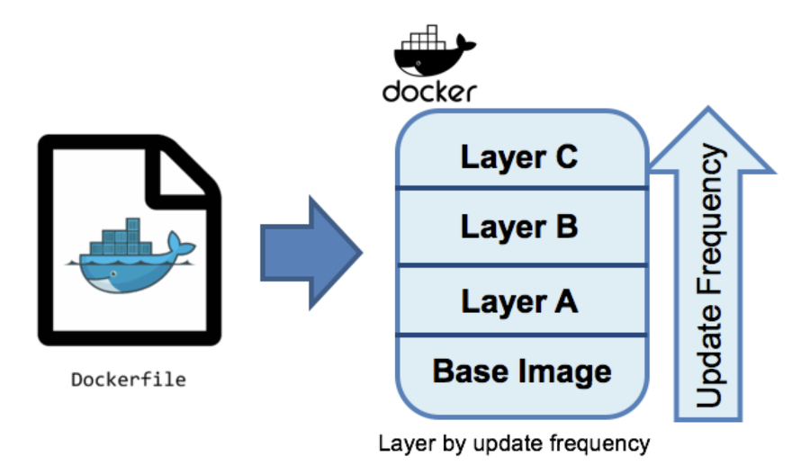
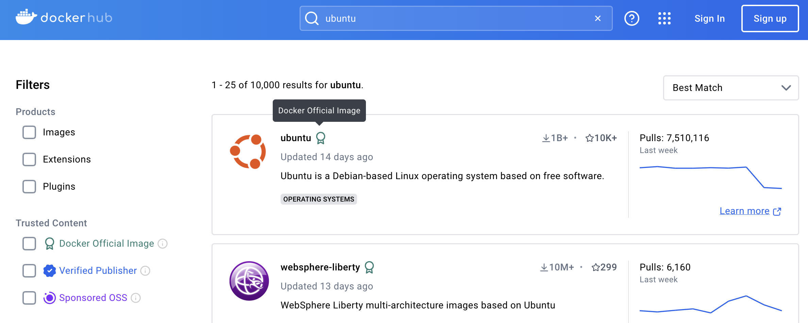

이전 글에서 컨테이너가 등장하게 된 배경과 컨테이너를 편리하게 이용할 수 있도록 도와주는 도커에 대해서 알아보았다.

앞서 이야기 한 것처럼 도커는 소프트웨어를 컨테이너로 패키징, 배포, 실행할 수 있는 이미지 기반의 플랫폼이다. 여기서 이미지는 컨테이너를 생성하는 템플릿으로 이해하면 좋다.

오늘은 도커의 이미지에 대해서 더 자세히 알아보도록 하겠다.

## 도커 이미지 (Docker Image)
도커 이미지는 컨테이너를 생성하는 데 사용되는 독립형 실행 파일이다. 보통 컨테이너 이미지라고도 많이들 부른다.

개발 환경과 배포 환경의 불일치, 복잡한 종속성 관리 등에서 컨테이너라는 개념이 등장하였고, 컨테이너 이미지는 이러한 문제를 해결하고 있다.

이미지는 **컨테이너의 실행에 필요한 모든 라이브러리, 종속성 및 파일이 포함되어 있는 불편의 템플릿**으로, 이를 기반으로 생성된 컨테이너는 어디서나 동일하게 동작한다. 이는 개발, 테스트, 배포 과정에서 환경을 일관적으로 유지하는 데 큰 도움이 된다.

### 도커 이미지 특징
- 불변성
  - 한 번 생성된 도커 이미지는 변경이 불가능하다.
  - 이 불변성 덕분에 항상 동일한 환경을 제공할 수 있다.
- 계층 구조
  
  - 도커 이미지는 여러 계층(layer)으로 구성되어 있으며, 각 계층은 이전 계층에 변경 사항을 추가한 것이다.
  - 베이스 이미지(Base Image)는 가장 아래에 위치한 기본 이미지로, 다른 이미지를 빌드할 때 그 기반이 된다. 일반적으로 운영 체제나 프로그래밍 언어의 런타임 환경을 베이스 이미지로 둔다.
  - 각 계층은 캐시되어 필요할 때만 업데이트 되기 때문에 이미지를 빠르게 빌드하고 배포할 수 있게 된다.
  - 각 계층을 독립적으로 관리하여, 변경 사항을 쉽게 추적하고 특정 layer 버전으로 롤백할 수 있다.

## 도커 허브 (Docker Hub)
**[도커 허브 사이트](https://hub.docker.com/)**

도커 허브(Docker Hub)는 도커 이미지의 저장, 공유, 관리 및 배포를 위한 중앙 저장소 역할을 하는 클라우드 기반 서비스이다. 도커 허브를 통해 개발자는 이미지를 쉽게 배포하고, 다른 개발자와 협업하며, 애플리케이션의 배포 파이프라인을 간소화할 수 있다.

실제 애플리케이션을 빌드할 때 필요한 베이스 이미지들을 도커 허브에서 찾을 수 있다. 어지간한 응용 프로그램들은 도커 허브에 존재한다.

### 신뢰할 수 있는 이미지 찾는 법
DockerHub에는 아무 개발자나 자신의 이미지를 올릴 수 있기 때문에 아무런 이미지를 가져다가 쓰는 것은 위험할 수 있다.

아래 세 Trusted Content 뱃지가 붙어있으면 사용해도 괜찮다고 판단된다.
- Docker Official Image : 도커사가 만든 이미지
- Verified Publisher : 벤더사(MS, Intel 등)에서 만든 이미지
- Sponsored OSS : 오픈소스 단체게 책임을 묻도록 하는 이미지

## References
- [AWS: 도커 이미지와 컨테이너의 차이점은 무엇인가요?](https://aws.amazon.com/ko/compare/the-difference-between-docker-../assets/post-images/and-containers/)
