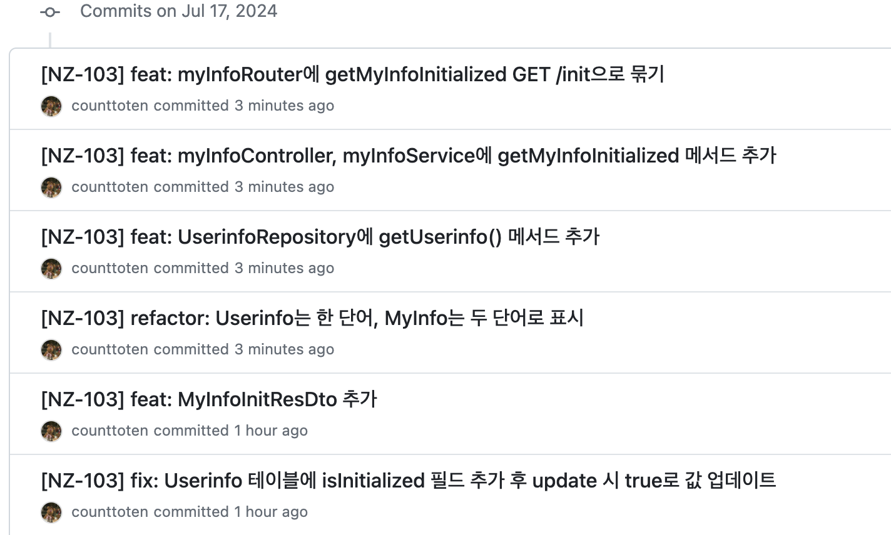

개발을 하다가 커밋을 작업 단위로 잘 나눠서 푸시해놓고, 커밋 메시지 앞에 지라 티켓 번호를 붙이는 것을 깜빡했다는 것을 알게 되었다.

~~아직도 티켓 번호 붙이는 것이 습관화가 안 되었다니...~~

참고로 우리 팀의 커밋 메시지 컨벤션은 다음과 같다.
```
[NZ-<티켓번호>] <commit type>: <커밋 메시지>
```
<br/>

보통 이럴 때마다 `git reset HEAD`를 통해 commit했던 전적을 지우고 다시 커밋을 작성하였는데, 이번엔 줄 단위로 세부적으로 commit을 해둔터라 메시지만 딱 바꾸고 싶었다.

그래서 이런 상황에서 어떻게 해야하는지 GPT한테 물어보았고 git rebase의 reword에 대해서 알게 되었다.

먼저 Git Rebase가 무엇인지 설명하고, 내 repository에 적용한 과정을 보여주고자 한다.

<br/>

## Git Rebase
[ATLASSIAIN 페이지에서 설명하는 Git Rebase](https://www.atlassian.com/git/tutorials/rewriting-history/git-rebase)


Rebase란 말 그대로 base를 바꾸는 것이다. 구체적으로는, 한 브랜치에서 다른 브랜치의 base commit을 새로운 base로 바꾸는 작업을 의미한다. 이를 통해 깔끔하고 직관적인 commit history를 유지할 수 있다.

### Rebase의 종류
Rebase의 종류로는 두 가지가 있는데, 아래와 같이 정리할 수 있다.
1. Regular Rebase
   - 단순히 브랜치의 base를 변경하여 커밋 히스토리를 재정렬하는 작업을 수행한다.
   - git rebase <branch> 명령어로 실행되며, 지정한 브랜치를 기준으로 현재 브랜치의 base를 변경한다.
   - 내가 주로 사용하던 rebase는 이 rebase이다. 아래는 내가 rebase를 주로 사용했던 방법이다.
     1. develop 브랜치에서 feature 브랜치를 파서 작업을 한다.
     2. develop에 변경사항이 생기고, 그것이 작업 중인 feature 브랜치에서 필요한 경우가 생긴다.
     3. 그럴 때 `git rebase develop` 명령어를 통해 develop 브랜치의 최신 커밋 내역들을 현재 작업 중인 브랜치로 가져오곤 한다.
2. Interactive Rebase
    - 커밋을 병합하는 과정에서 개별 커밋을 수정하거나, 삭제하거나, 합칠 수 있는 기능을 제공한다.
    - `git rebase -i` 명령어를 사용하며, 커밋 메시지나 순서를 변경하고 싶을 때 유용하다.
    - 이 interactive rebase를 통해 내가 필요로 하던 **개별 커밋 메시지의 수정**을 할 수 있다.

### Rebase 사용 시 주의할 점
Rebase를 사용하면 커밋 히스토리를 깔끔하게 유지할 수 있지만, 협업 시에는 주의해서 사용해야 한다.

> 이미 공유된 브랜치에 대해 rebase를 실행하면 히스토리가 변경되므로, 그 브랜치에서 작업하던 다른 이들과 충돌이 발생할 수 있다.
{: .prompt-warning }

이를 방지하기 위해서는 **로컬 브랜치 혹은 개인 작업 브랜치에서만 rebase를 실행**하는 것이 좋다.

<br/>

## Interactive Rebase 적용
일단 나는 4개의 커밋 메시지를 수정하고 싶으므로 아래와 같이 터미널에 입력한다.
현재 HEAD로 부터 4 커밋 이전으로 git base를 옮긴다는 의미이다.
```shell
git rebase -i HEAD~4
```
위 명령어를 실행하면 아래와 같은 vi 편집기가 뜬다.

읽어보면 각 커밋 라인 맨 앞에 있는 `pick` 명령어를 원하는 명령어로 수정하면 되는 듯 하다. 위에서부터 아래로 수행되기 때문에 여기서 순서를 바꾸면 커밋 순서 또한 변경할 수 있다고 한다. 주의해야 할 점은 커밋 라인을 삭제하면 안 된다는 것이다. 맨 아래에 대문자로 설명하듯이 커밋 기록이 아예 날아간다고 한다.

<br/>

내가 필요한 것은 커밋 자체는 사용하되, 커밋 메시지를 수정하는 것이기에 `pick` 명령어를 `reword`로 수정하였다. 작성을 다 하였으면 저장 후 나가면 된다. (vi 편집기에서는 esc 버튼을 눌러 명령 모드로 진입 후 `:wq` 를 입력한 후 엔터를 누르면 된다.)


그러면 이런 식으로 첫번째 줄에 있던 커밋 라인부터 하나씩 이름을 수정할 수 있는 vi 편집기가 차례대로 뜬다.


원하는 대로 앞에 지라 티켓 번호를 수정 후 마찬가지로 `:wq`


나는 수정하고자 하는 커밋 메시지가 총 4건이었기에 위 창이 총 4번 떴다. 각각 수정 후 저장을 해주었다.

입력을 전부 마치면 rebase가 정상적으로 반영되었다는 메시지가 뜬다. (캡처를 깜빡하였다..)

git log를 찍어보면 reword를 통해 수정한 커밋 메시지들이 정상적으로 변경된 것을 볼 수 있다.


<br/>

이제 git push를 통해 remote branch에도 반영되도록 하려했으나 거부당했다. 히스토리가 달라서 push가 어렵다고 한다. 
```shell
git push
To https://github.com/<git repository>.git
 ! [rejected]        feature/userinfo_is_initialized -> feature/userinfo_is_initialized (non-fast-forward)
error: failed to push some refs to 'https://github.com/<git repository>e.git'
hint: Updates were rejected because the tip of your current branch is behind
hint: its remote counterpart. Integrate the remote changes (e.g.
hint: 'git pull ...') before pushing again.
hint: See the 'Note about fast-forwards' in 'git push --help' for details.
```

강제로 push를 하기 위해 `git push --force`를 해준다. (같이 쓰는 브랜치라면 --force 마음대로 하면 안 된다..! git rebase는 앞으로도 개인 작업 브랜치에만 써야겠다..)


remote repository에도 반영된 모습이다.


### 느낀 점
이렇게 실수를 자꾸 하게 되니 git commit lint 규칙 같은 것을 알아보아 프로젝트에 반영해야지하는 생각이 든다. <br/>
보아하니 commit message 스타일이 정해둔 규칙과 다르면 아예 커밋이 불가능하게 만들 수 있는 것 같던데 스프린트 기간이 끝나고 여유로울 때 한 번 알아보아야 겠다.