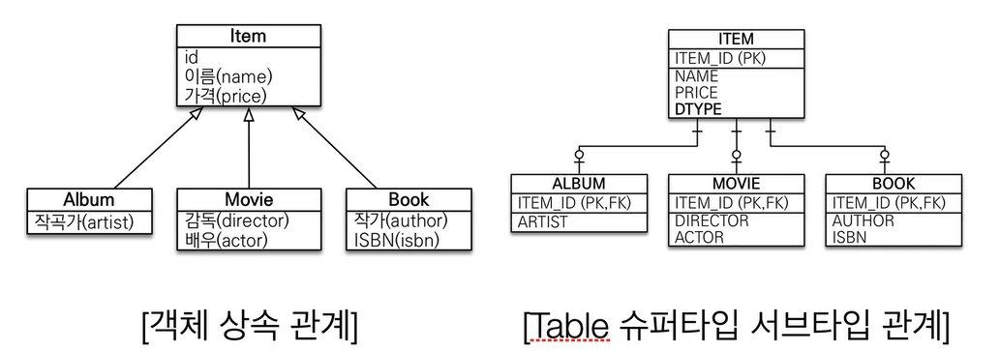
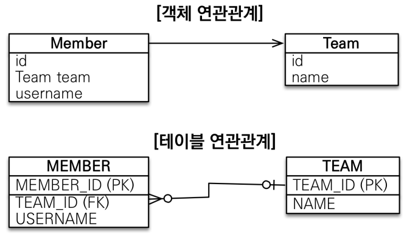
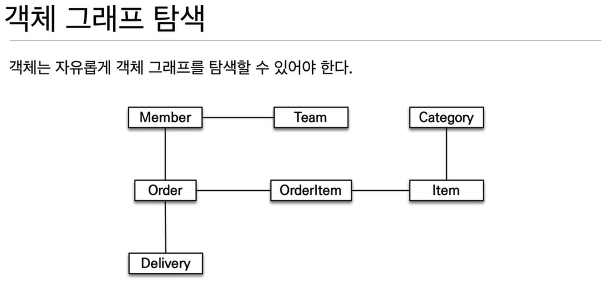
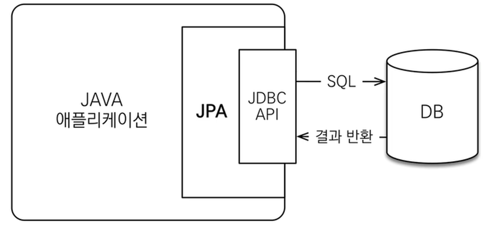
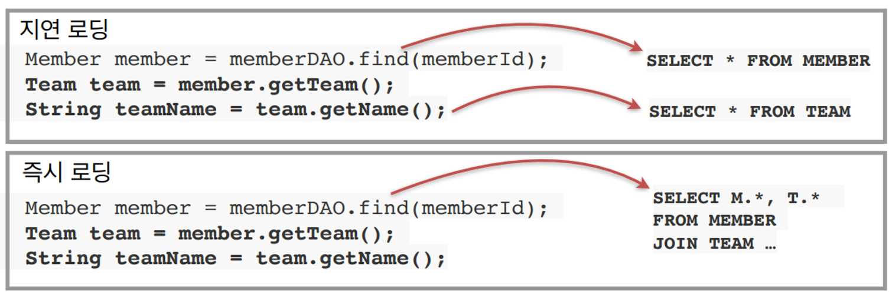

> 김영한님의 [JPA ORM 기본편](https://www.inflearn.com/course/ORM-JPA-Basic) 중 섹션 1. JPA 소개편을 듣고 정리한 내용입니다.

## SQL 중심적인 개발의 문제점

우리가 주로 개발을 할 때 애플리케이션은 객체 지향 언어를 사용하고, 데이터베이스는 관계형 DB를 이용하여 설계한다.

그러다 보니 객체를 SQL로 바꾸어 관계형 DB에 저장해야 하는데, 개발자가 직접 하기 위해서는 수많은 SQL 쿼리를 짜야한다. ~~(무한 반복되는,, 지루한 코드,,,)~~

그런 반복되는 작업을 줄이기 위해 자바 진영에 JPA가 등장하게 되었고, 어지간한 자바 기반의 서비스 개발에 쓰이고 있는데, 이 강의를 통해 JPA가 무엇이고, 사용하면 어떤 이점이 있는지 알아보도록 한다.

### 객체와 관계형 데이터베이스의 차이

**상속**

- 객체에는 **상속 관계**가 존재한다.
  - Album 데이터를 생성하려면, `list.add(album);`과 같은 한 줄의 코드를 통해 생성한다.
- 관계형 데이터베이스에서 객체처럼 상속 관계를 표현하려면? ⇒ **슈퍼타입 서브타입** 관계를 이용해야 한다.
  - Album 객체 데이터를 데이터베이스에 저장하려면?
    - ITEM, ALBUM 두 개의 테이블에 INSERT 쿼리를 날려야 한다. → 2개의 쿼리!
  - 데이터를 가져올 때도 슈퍼타입, 서브타입 테이블을 JOIN하는 작업을 거쳐야 한다.

**연관 관계**

- 객체는 **참조**를 사용한다.
  - 데이터를 조회하는 법은 아래와 같다.
    ```java
      Member member = list.get(memberId);
      Team team = member.getTeam();
    ``` 
- 테이블은 **외래 키를 사용하여 조인**해야 한다.
  - 데이터를 조회하려면 아래와 같은 복잡한 과정을 거쳐야 한다.
    ```sql
      SELECT M.*, T.*
      FROM MEMBER M
      JOIN TEAM T OR M.TEAM_ID = T.TEAM_ID
    ```
- 객체는 객체 그래프를 자유롭게 탐색할 수 있어야 한다.
    
  - 위와 같은 객체 그래프가 있다고 하면, member.getTeam(), member.getOrder()와 같은 식으로 다른 객체들을 쉽게 찾을 수 있다.
  - 반면 테이블은 자유롭게 탐색하기 위해서는 모든 테이블을 전부 다 조인해서 연관된 객체들을 불러와야 한다. 하지만 그건 너무 비효율 적이므로, 비즈니스 로직에 따라 상황별 필요한 회원 조회 메서드를 여러 벌 생성하고는 한다.
    ```java
    memberDAO.getMember();
    memberDAO.getMemberWithTeam();
    memberDAO.getMemberWithOrderWithDelivery();
    ```

**데이터 식별 방법**
- 테이블을 객체 지향형으로 설계한다면 아래와 같이 설계할 수 있다.
   
    ```java
    class MemberDAO {
      public Member getMember(String memberId) {
        String sql = "SELECT * FROM MEMBER WHERE MEMBER_ID = ?";
        ...
        return new Member(...);
      }
    }
    
    String memberId = "100";
    Member member1 = memberDAO.getMember(memberId);
    Member member2 = memberDAO.getMember(memberId);
    
    member == member2; // 다르다
    ```
  - member1과 member2는 sql문이 매번 `new Member()`로 인스턴스를 만들어 리턴한 값이 들어있기에 둘을 비교하면 다르다고 나온다. 
- 자바 컬렉션에서는 아래와 같이 같은 객체에 대해서는 같다고 한다.
        
    ```java
    String memberId = "100";
    Member member1 = memberDAO.getMember(memberId);
    Member member2 = memberDAO.getMember(memberId);
    
    member == member2; // 같다
    ```

> 객체답게 모델링 할수록 매핑 작업만 늘어난다…! ⇒ 객체를 자바 컬렉션에 저장 하듯이 DB에 저장하자
{: .prompt-callout }
<br/>

## JPA 소개

### ORM = Object-relational Mapping (객체 관계 매핑)
객체는 객체대로, 관계형 데이터베이스는 관계형 데이터베이스대로 설계를 한 후, ORM 프레임워크가 중간에서 매핑을 하도록 한다.

### JPA = Java Persistence API
JPA는 Java 애플리케이션의 관계형 데이터를 관리하기 위한 표준 ORM이다. JPA를 사용하여 자바 객체와 데이터베이스 테이블을 매핑하고, 데이터를 처리할 수 있다.



기존에는 개발자들이 직접 JDBC API를 가져다 데이터베이스에 쿼리를 날렸는데, JPA가 등장하면서 데이터 처리가 쉬워졌다.

### JPA가 하는 일
- Entity 분석
- SQL 생성
- JDBC API 사용
- ResultSet 매핑
- 패러다임의 불일치 해결

### JPA의 역사
- 기존에는 EJB(Enterprise Java Bean) 엔티티 빈이 자바 표준으로 존재하였으나, 사용하기 어렵고 성능이 좋지 않아 개발자들이 사용하기 힘들어하였다.
- 이를 해결하기 위해 하이버네이트라는 오픈소스 프레임워크가 등장하였다. 하이버네이트는 간편한 사용법과 뛰어난 성능으로 인기를 끌었다.
- 결국 JPA라는 자바 표준이 만들어졌다.
- JPA는 하이버네이트의 기능을 거의 그대로 반영한 (복사 붙여넣기 수준..) 표준 인터페이스로, 매우 실용적이다.
  
### JPA를 사용하는 이유
- SQL 중심적인 개발에서 객체 중심으로 개발할 수 있게 되었다.
- 생산성이 매우 높다.
  - 단순한 CRUD 코드를 쉽게 작성할 수 있다.
- 유지보수에 용이하다.
  - 기존에는 필드 변경 시 모든 SQL을 수정해야 했다.
  - JPA를 사용하면 개발자는 필드만 수정하면 된다. SQL은 JPA가 수정해준다.
- 객체와 관계형 데이터베이스의 차이에서 오던 패러다임의 불일치를 해결한다.
  1. 상속
    - 저장
      - 개발자는 `jpa.persist(album);` 만 작성하면 실제 ITEM, ALBUM 두 테이블에 데이터를 집어넣는 SQL은 JPA가 처리한다.
    - 조회
      - 개발자는 `Album album = jpa.find(Album.class, albumId);` 만 작성하면, 실제 `SELECT I., A. FROM ITEM I JOIN ALBUM A ON I.ITEM_ID = A.ITEM_ID` 와 같은 SQL은 JPA가 처리한다.
  2. 연관관계
    - 객체 그래프 탐색: 신뢰할 수 있는 엔티티, 계층임이 보장되어 자유로운 객체 그래프 탐색이 가능해진다. 
  3. 데이터 식별
    - 동일한 트랜잭션에서 조회한 엔티티는 같음을 보장한다.
- 성능이 뛰어나다.
  - 1차 캐시
    ```java
    String memberId = "100";
    Member m1 = jpa.find(Member.class, memberId); // SQL 조회
    Member m2 = jpa.find(Member.class, memberId); // 1차 캐시
    println(m1 == m2) //true
    ```
    - 한 트랜잭션 내에서 1차 캐시를 관리하여 SQL문의 실행을 줄인다. → 약간의 조회 성능의 향상을 가져온다.
  - 트랜잭션을 지원하는 쓰기 지연
    - JDBC BATCH SQL 기능을 사용하여 한번에 SQL들을 전송한다.
    - `transaction.begin();` → SQL 작성 → `transaction.commit();` 와 같이 코드를 작성하면 커밋 시점에 작성한 SQL을 모아서 한 번에 전송한다.
    - 커밋하는 순간에 SQL을 보내기 때문에 UPDATE, DELETE로 인한 ROW 락 시간 최소화 할 수 있다. → 약간의 성능 향상
  - 지연 로딩 (Lazy Loading)
    
    - 지연 로딩(Lazy Loading)은 실제로 필요한 시점까지 데이터를 조회하지 않고, 해당 데이터에 접근할 때 데이터를 로딩하는 방식이다.
      - Member를 처음 로딩 시에는 연관된 Team 객체를 껍데기로만 가지고 있고, Team의 값을 실제 사용할 필요가 생기면 그 때 값을 데이터베이스에서 가져온다.
    - 필요한 순간에만 데이터를 조회하여 메모리 사용을 줄이고 애플리케이션 성능을 향상시킬 수 있다.