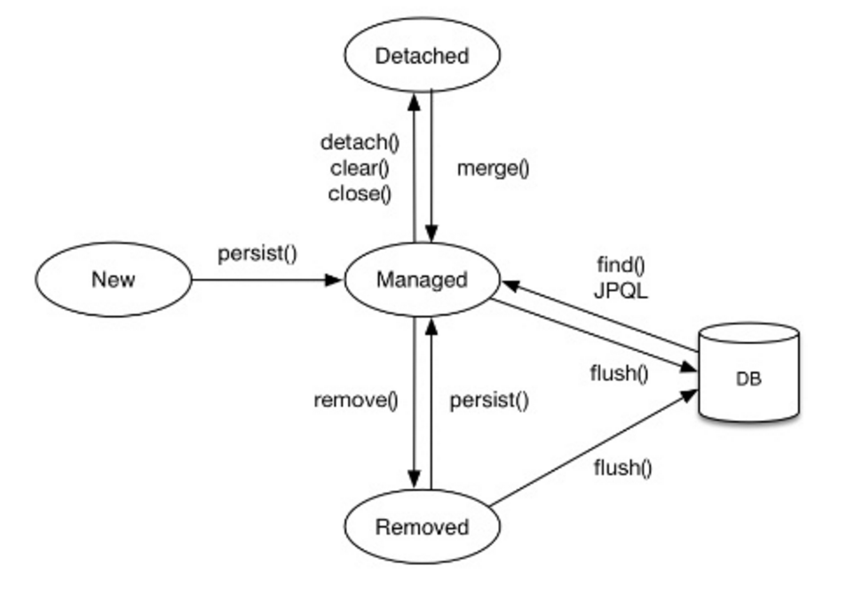
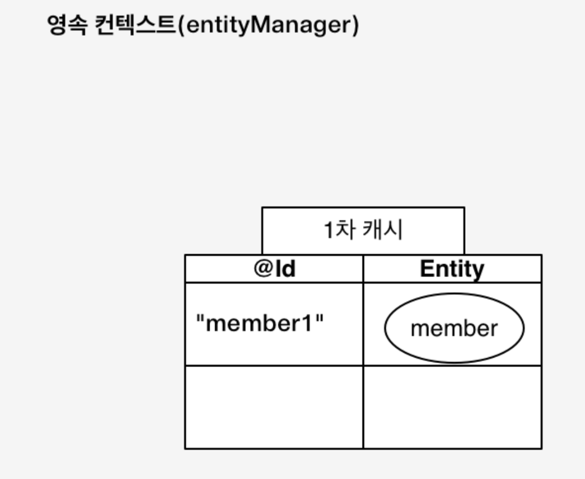
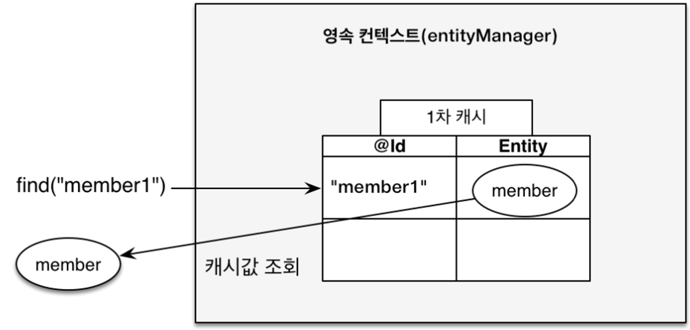
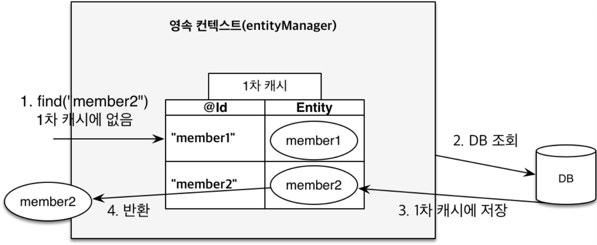
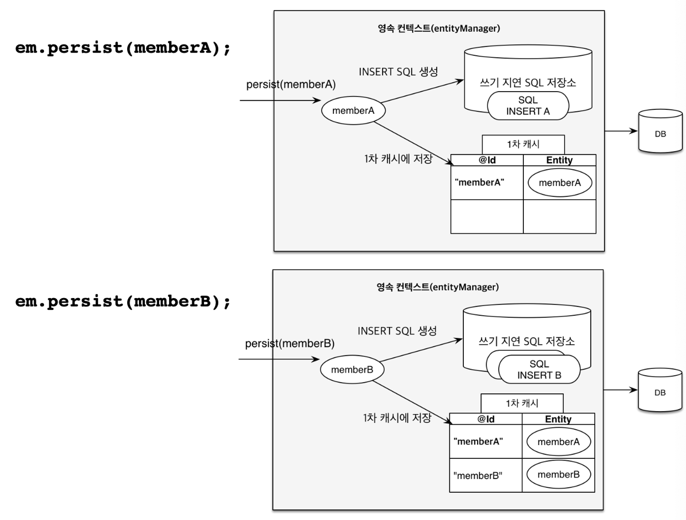
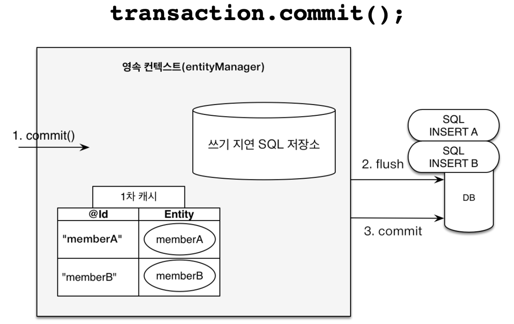
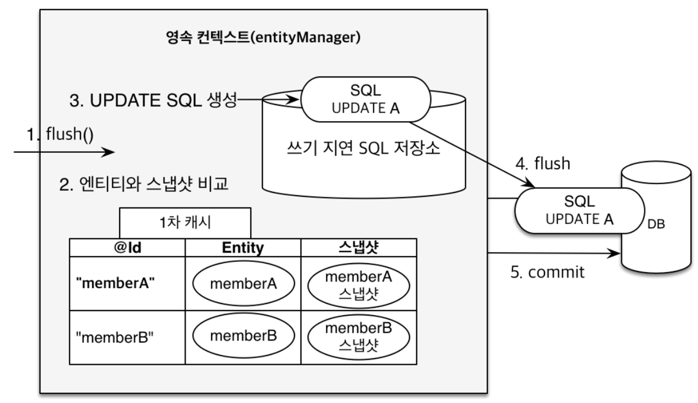

> 김영한님의 [JPA ORM 기본편](https://www.inflearn.com/course/ORM-JPA-Basic) 중 섹션 3. 영속성 관리 편을 듣고 정리한 내용입니다.

## 영속성 컨텍스트란
영속성 컨텍스트(Persistence Context)는 엔티티 매니저(Entity Manager)가 관리하는 엔티티 객체들의 집합으로, **엔티티를 영구 저장하는 환경**이다.

영속성 컨텍스트 내에서 관리되는 엔티티는 특정 생명주기를 가지며, 이 컨텍스트를 통해 데이터베이스와 동기화된다.

## 엔티티의 생명주기

1. 비영속 (new)
   1. 영속성 컨텍스트와 전혀 관계가 없는 상태를 뜻한다.
   2. 새로운 객체를 생성했지만 아직 영속성 컨텍스트에 의해 관리되지 않는 상태이다.
2. 영속 (managed)
   1. 영속성 컨텍스트에 관리되는 상태를 뜻한다.
   2. 데이터베이스와 동기화되어 있다.
3. 준영속 (detached)
   1. 영속성 컨텍스트에 의해 관리되던 객체를 영속성 컨텍스트에서 분리할 시 그 객체는 준영속 상태가 된다.
   2. 데이터베이스와의 연결이 끊어진 상태로, 변경 사항이 데이터베이스에 반영되지 않는다.
4. 삭제
   1. 엔티티가 삭제되도록 표시된 상태이다.
   
### 코드로 보는 엔티티의 생명주기
```java
// 객체를 생성한 상태 (비영속)
// - 아무 상태도 아니다!
Member member = new Member();
member.setId("member1");
member.setUsername("회원1");

EntityManager em = emf.createEntityManager();
em.getTransaction().begin();

// 객체를 저장한 상태 (영속)
// - EntityManager 안에 있는 영속성 컨텍스트에 의해 이 멤버는 관리된다.
em.persist(member);

// 객체를 영속성 컨텍스트에서 분리 (준영속)
em.detach(member);

// 객체를 삭제한 상태 (삭제)
em.remove(member);
```


## 영속성 컨텍스트의 이점

### 1차 캐시
영속성 컨텍스트는 내부에 1차 캐시를 들고 있다.

1. 1차 캐시에 값 저장
    ```java
    Member member = new Member();
    member.setId("member1");
    member.setUsername("회원1");

    // 엔티티 영속
    // -> 1차 캐시 내에 Entity를 저장해둠!
    em.persist(member);
    ```
    
2. 1차 캐시 값 사용
   ```java
   Member findMember = em.find(Member.class, "member1");
   ```
  
   
   값을 조회 할 시 DB로 바로 가지 않고 1차 캐시에 있는지 부터 찾는다. 1차 캐시에 찾는 값이 있다면 바로 값을 리턴한다. 
  
   
   1차 캐시에 찾는 값이 없다면 그때 DB에서 값을 조회 후 반환한다. 그 과정에서 1차 캐시에 DB에서 찾은 값을 저장한다.


> 사실 1차 캐시는 그렇게 도움이 되지 않는다.
> - 데이터베이스의 한 트랜잭션 안에서만 유효한 캐시이기 때문에 매우 찰나의 순간에만 유효하다.
> - 성능 이점으로 크게 작용하지 않는다.


### 영속 엔티티의 동일성 보장
같은 트랜잭션 내 조회한 엔티티가 동일함을 보장한다. (1차 캐시 덕분)

```java
Member a = em.find(Member.class, "member1");
Member b = em.find(Member.class, "member1");
System.out.println(a == b); // true
```

### 트랜잭션을 지원하는 쓰기 지원 (Transactional write-behind)
```java
transaction.begin(); // [트랜잭션] 시작

em.persist(memberA);
em.persist(memberB);
//여기까지 INSERT SQL을 데이터베이스에 보내지 않는다.

//커밋하는 순간 데이터베이스에 INSERT SQL을 보낸다.
transaction.commit(); // [트랜잭션] 커밋
```

영속 컨텍스트 내에는 쓰기 지연 SQL 저장소가 있다.

`em.persist(memberA)` 시 쓰기 지연 SQL 저장소 내에 memberA를 insert 하는 쿼리가 쌓인다.



`commit()` 시 쓰기 지연 SQL 저장소 내의 SQL들이 한 번에 flush 된다.


### 변경 감지 (Dirty Checking)
```java
transaction.begin(); // [트랜잭션] 시작

// 영속 엔티티 조회
Member memberA = em.find(Member.class, "memberA");

// 영속 엔티티 데이터 수정
memberA.setUsername("hi");
memberA.setAge(10);

//em.update(member) 이런 코드가 있어야 하지 않을까?

transaction.commit(); // [트랜잭션] 커밋
```



컬렉션의 값을 변경하듯이 값만 바꿨는데, 자동으로 변경사항이 db에 저장이 된다!

commit 시점에 **1차 캐시** 내의 entity와 **스냅샷**을 **비교**한다.
(스냅샷이란? 1차 캐시로 엔티티를 가져올 때의 초기의 값을 저장해둔 것)

스냅샷이 바뀌었다면? UPDATE를 수행하는 쿼리가 자동으로 생성한다.

### 지연 로딩
추후 강의에서 더 자세히 설명해주신다고 한다. 다음 강의도 열심히 들어보겠다.