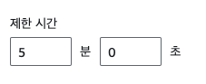

프로젝트를 진행하면서 3일마다 사용자의 구독 정보를 갱신해주기로 하였다.

72시간 마다 특정 행위를 수행하는 크론 잡(Cron Job)을 무엇으로 구축할까 하다가 이전에 아는 분이 Cron Job을 수행하기 위하여 CloudWatch를 활용하여 자동으로 일정 주기로 lambda 함수를 트리거하여 작업을 수행하는 아키텍처 구조를 본 것이 기억나, 우리 서비스에도 해당 아키텍처를 도입하기로 하였다.

그러다 AWS 공식 문서에서 크론 잡을 수행하기 위해 쓰이던 CloudWatch Events가 EventBridge로 분리되었다는 것을 발견하였다.
> EventBridge was formerly called Amazon CloudWatch Events. The default event bus and the rules you created in CloudWatch Events also display in the EventBridge console. EventBridge uses the same CloudWatch Events API, so your code that uses the CloudWatch Events API stays the same.
그래서 우리 프로젝트에는 Lambda와 EventBridge를 도입해보기로 하였다.

먼저 호출되어야 하는 코드를 작성하여 웹훅으로 배포하였다.

이제 해당 엔드포인트에 POST 요청 보내는 AWS lambda 함수를 생성한 후 EventBridge Scheduler를 사용하여 72시간마다 트리거 하도록 하려고 한다.

## Lambda 함수 생성
refresh-watch 의 이름으로 람다 함수를 생성해주었다.

### 코드 작성
노드로 아래와 같이 코드를 작성하였다.

```javascript
import https from 'https';

export const handler = async (event) => {
  const options = {
    hostname: process.env.SUPABASE_HOST,
    path: '/functions/v1/refresh-watch',
    method: 'POST',
    headers: {
      'Authorization': `Bearer ${process.env.AUTH_TOKEN}`
    }
  };

  return new Promise((resolve, reject) => {
    const req = https.request(options, (res) => {
      if (res.statusCode === 200) {
        console.log('Successfully refreshed watch');
        resolve();
      } else {
        reject(new Error(`Failed with status code: ${res.statusCode}`));
      }
    });

    req.on('error', (e) => {
      reject(e);
    });

    req.end();
  });
};
```
### 람다 함수 설정값 변경
구성 > 일반 구성
- 호출하는 웹훅이 처리하는 작업이 많아 오래걸리기 때문에 timeout 값을 디폴트인 3초로 두면 에러가 발생하였다.
-  걸리는 현상이 발생하여 제한 시간을 5분으로 설정하였다.
-  

### 환경 변수 추가
함수 > 구성 > 환경 변수
- 서버와의 통신 시 람다가 트리거한 경우에만 해당 작업을 수행하기 위해 authorization을 위한 값을 환경 변수로 추가하였다.


## Amazon EventBridge 설정


EventBridge는 위 이미지와 같이 서버리스 스케줄러로, 이를 사용하면 Cron 표현식을 이용해 정기적으로 실행되는 스케줄링 작업을 수행할 수 있다.
우리는 EventBridge를 통해 특정 시간 간격으로 Lambda 함수를 자동으로 트리거하도록 설정하겠다. 

### Scheduler 일정 생성
1. 일정 세부 정보 지정
    
    

    위에서는 이름만 지정하였고, 아래에서는 반복 일정, Rate 기반 일정을 선택하여 72시간마다 반복적으로 특정 작업을 수행하도록 하였다.
2. 대상 선택 
   템플릿 형식의 대상 중 AWS Lambda Invoke를 선택한다.

    

   Invoke할 함수 지정 

    
3. 설정
   재시도를 얼마나 시도해야 할지 확실하지 않아 일단 여유롭게 설정해 두었다. 서비스 운영 중에 적절하지 않은 값 같으면 수정하도록 하겠다.
   

   권한은 기본 지정되어 있던 대로 '새 역할 생성'으로 두었다.
    

아래와 같이 일정이 생성되었다.


## 결과
이로 인해 webhook이 잘 호출 되는 것을 볼 수 있었다.

추가로 lambda 함수가 invoke 된 결과를 보고 싶다면 lambda 함수의 콘솔에서 모니터링 탭으로 가면 된다.
오른쪽 위의 CloudWatch Logs 보기 버튼을 통해 찍힌 로그도 볼 수 있다.
