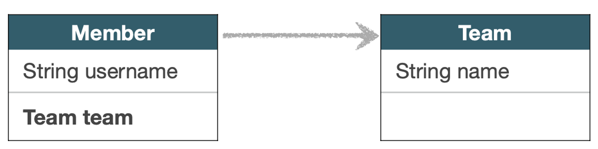
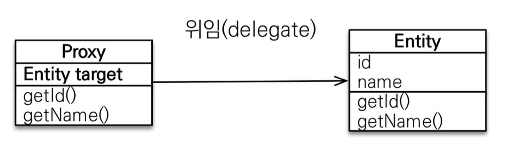
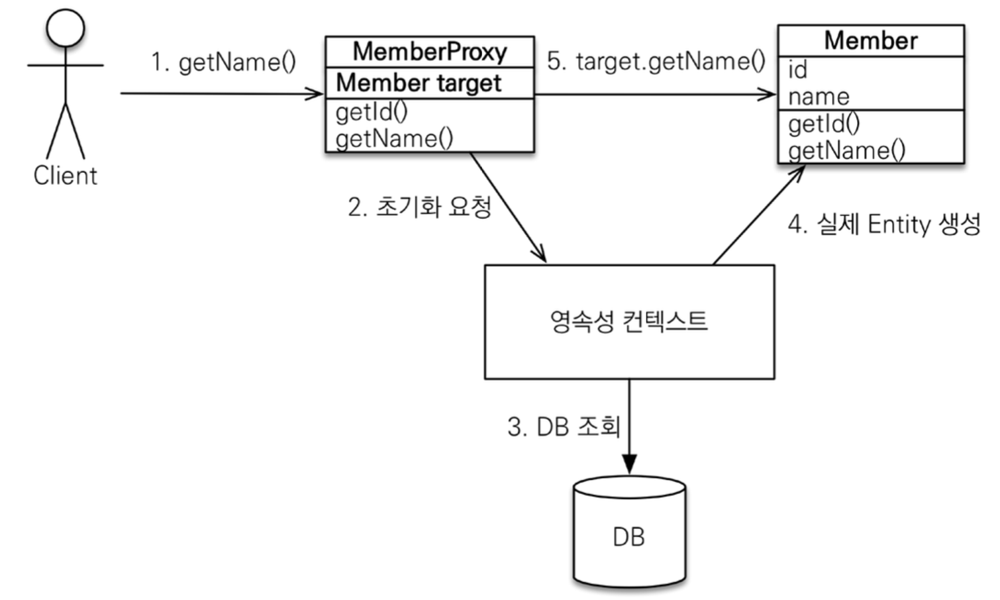

> 김영한님의 [JPA ORM 기본편](https://www.inflearn.com/course/ORM-JPA-Basic) 중 섹션 8. 프록시와 연관관계 편을 듣고 정리한 내용입니다.

아래와 같이 연관관계가 매핑된 상황에서 Member를 조회할 때 Team도 항상 함께 조회해야 할까?



비즈니스 로직 상 매번 조회해야 하는 경우도 있겠지만, 대부분의 경우에는 그렇지 않을 것이다. 사용하지도 않는데 매번 가져오는 것은 비효율적이다. 이 문제를 해결하기 위해 JPA는 **프록시**라는 개념을 제공한다. 프록시는 실제 엔티티를 조회하지 않고도 마치 엔티티를 조회한 것처럼 동작할 수 있는 객체이다.

JPA의 프록시는 엔티티를 실제로 사용하는 시점까지 데이터베이스 조회를 지연시킴으로써 성능 최적화를 가능하게 한다.

### entitymanager.getReference()
데이터베이스를 통해서 실제 엔티티 객체를 조회할 때 EntityManager의 `find()` 메서드를 사용할 수 있다. 반면, 데이터베이스 조회를 미루는 프록시 엔티티 객체를 조회하고 싶다면 `getReference()` 메서드를 사용하면 된다.

```java
Member findMember = em.getReference(Member.class, member.getId());
// 이 시점에는 조회 쿼리 실행되지 않음.
System.out.println("findMember.id = " + findMember.getId());
// 실제 값이 조회되는 이 시점에 조회 쿼리 실행된다.
System.out.println("findMember.name = " + findMember.getName());
```

위 코드를 실행해보면 getReference()를 수행하면 객체를 찾아서 반환하는 것처럼 보이지만, 실제 데이터베이스에는 조회 쿼리가 나가지 않는다. 그 객체의 값을 실제 사용되는 시점이 되서야 조회 쿼리를 실행한다.

## 프록시의 특징
- 실제 클래스를 상속받아서 만들어진다
  - 프록시 객체는 실제 클래스의 서브 클래스 형태로 생성된다. 따라서 실제 클래스와 동일한 메서드를 가지고 있다.
- 실제 클래스와 겉모양이 같다
  - 프록시 객체는 실제 클래스와 동일한 인터페이스를 구현하거나, 실제 클래스의 서브 클래스이기 때문에 겉모습이 같다.
  - 사용하는 입장에서는 진짜 객체인지 프록시 객체인지 구분하지 않고 사용하면 된다. (이론상)
- 프록시 객체는 실제 객체의 참조를 보관한다
   
- 프록시 객체를 호출하면 프록시 객체는 실제 객체의 메소드를 호출한다

### 프록시 객체 초기화 과정
**객체의 값을 처음 사용할 때**

프록시 객체는 **처음 사용할 때 한 번만 초기화**된다. 이 초기화 과정은 프록시 객체가 실제 엔티티로 바뀌는 것이 아니라, 내부의 target 값이 채워지는 것을 의미한다. 따라서 두 번째 호출부터는 초기화 과정 없이 메서드가 호출된다. (두 번째 호출부터는 1 -> 5 로 수행된다.)

1. getName() 메서드 호출 (실제 값 사용)
2. 영속성 컨텍스트에 초기화 요청
   - 아직 초기화되지 않은 프록시 객체는 자신을 관리하는 영속성 컨텍스트(EntityManager)에게 초기화를 요청한다.
3. DB 조회
   - 영속성 컨텍스트는 데이터베이스에 해당 엔티티의 실제 데이터를 조회하는 SQL 쿼리를 실행하여 필요한 데이터를 가져온다.
   - *(추가) 만약 이미 영속성 컨텍스트에 해당 엔티티가 존재한다면?*
      - getReference()로 프록시 객체를 생성하는 시점에 이미 영속성 컨텍스트에 찾는 엔티티가 존재하였다면, getReference는 애초에 프록시 객체를 생성하지 않고 실제 객체를 반환한다.
      - 프록시 객체는 이미 생성된 시점에서, 프록시 초기화 이전에 다른 메서드에 의해 영속성 컨텍스트에 해당 엔티티가 추가 되었다면? (그런 상황이 있을지는 잘 모르겠다.) 초기화 요청 시 영속성 컨텍스트에 값이 있다면 DB에 조회 쿼리를 내보내지 않고 그냥 영속성 컨텍스트에 있는 엔티티 객체를 반환할 것이다.
4. 실제 엔티티 생성
   - DB에서 조회한 데이터로 실제 엔티티 객체를 생성한다.
5. 프록시 객체의 target 값을 실제 엔티티로 채운다.
   - 이를 통해 이후 프록시의 메서드 호출 시 프록시가 아닌 실제 엔티티의 메서드가 호출되도록 합니다.
