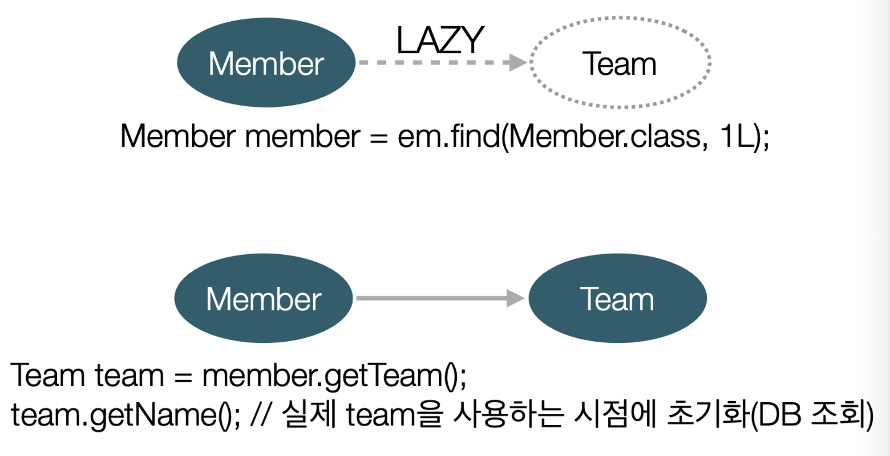
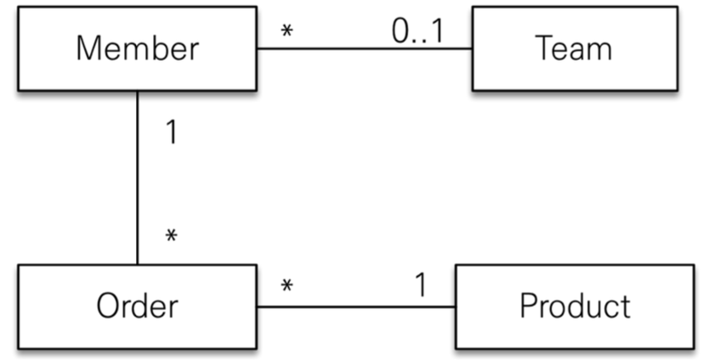

> 김영한님의 [JPA ORM 기본편](https://www.inflearn.com/course/ORM-JPA-Basic) 중 섹션 8. 프록시와 연관관계 편을 듣고 정리한 내용입니다.

[이전 포스트](https://counttoten.github.io/posts/jpa-orm-3/)에서 프록시에 대해서 공부하였다.
이어서 프록시를 사용함으로써 얻게 되는 가장 큰 이점인 지연 로딩에 대해 알아보도록 하겠다.

### 지연 로딩 (LAZY Loading)

지연 로딩은 엔티티를 실제로 사용할 때까지 데이터베이스 조회를 미루는 기법이다.
JPA 프록시 객체를 통해 필요할 때만 데이터를 로딩하여 애플리케이션의 성능을 최적화할 수 있다.
지연 로딩을 활용하면 불필요한 데이터베이스 접근을 줄이고, 메모리 사용량을 효율적으로 관리할 수 있다.

```java
private class Member {
   // ...
   @ManyToOne(fetch = FetchType.LAZY)
   @JoinColumn(name = "TEAM_ID")
   private Team team;
}
```


- Member 내 Team을 실제 사용하기 전에는 Proxy로 껍데기만 들고 있는다.

### 즉시 로딩 (EAGER Loading)

지연 로딩의 반대 개념으로 즉시 로딩이 존재한다.
즉시 로딩은 엔티티를 조회할 때 연관된 엔티티도 함께 조회하는 방식이다.

```java
private class Member {
   // ...
   @ManyToOne(fetch = FetchType.EAGER)
   @JoinColumn(name = "TEAM_ID")
   private Team team;
}
```


- Member 조회 시 항상 Team도 조회한다.
- SQL 조회 쿼리 두 번 날릴 수도 있고, 조인해서 한 번에 함께 조회할 수도 있다.
    - (이건 구현하기 나름)
    - JPA 구현체는 가능하면 조인을 사용하여 SQL 한번에 함께 조회한다.

### 즉시로딩 시 주의점

즉시 로딩을 적용하면 예상하지 못한 SQL이 발생한다.

- JPQL에서 N+1 문제를 일으킨다. (1개만 조회하려 했으나, N개의 쿼리가 함께 나감)

> 실무에서는 가급적 **지연로딩만 사용**하자!
>
> - @ManyToOne, @OneToOne 는 기본이 즉시 로딩 → Lazy로 설정해주자!
> - @OneToMany, @ManyToMany는 기본이 지연 로딩이다.
{: .prompt-callout }

- (이론적인) 지연 로딩 활용
    
    
    
    - Member - Team 자주 함께 사용 → 즉시 로딩
    - Member - Order 가끔 사용 → 지연 로딩
    - Order - Product 자주 함께 사용 → 즉시 로딩
- (실무에서) 지연 로딩 활용
    - ALWAYS
    - **실무에서 즉시 로딩을 사용하지 마라!**
        - 즉시 로딩할 필요가 있다면 JPQL의 fetch join이나, 엔티티 그래프 기능을 사용하자.
        - 즉시 로딩은 상상하지 못한 쿼리가 나간다.