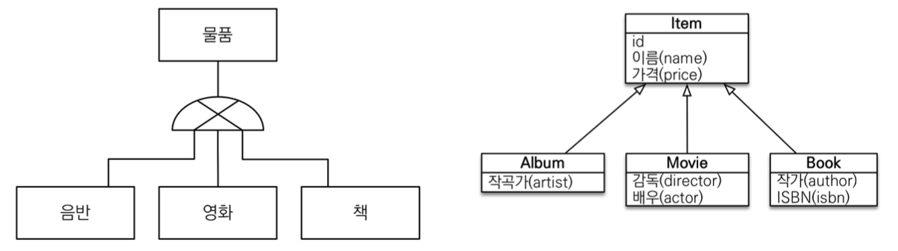
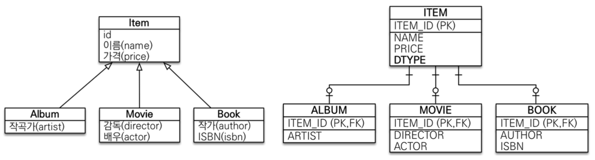
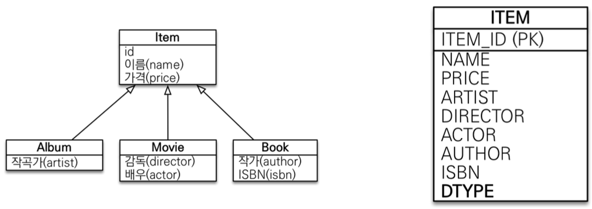
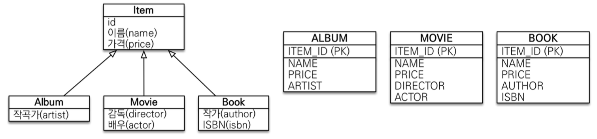

> 김영한님의 [JPA ORM 기본편](https://www.inflearn.com/course/ORM-JPA-Basic) 중 섹션 7. 고급 매핑 편을 듣고 정리한 내용입니다.

## 상속관계 매핑이란?


객체의 상속 구조를 데이터베이스의 슈퍼타입 서브타입 관계를 매핑하는 방법이다. JPA에서는 객체의 부모 클래스와 자식 클래스 간의 상속 관계를 데이터베이스에서도 적절히 표현하기 위해 몇 가지 전략을 제공한다.

### 상속관계 매핑 예시 코드
```java
@Entity
@Inheritance(strategy = InheritanceType.SINGLE_TABLE)
@DiscriminatorColumn(name = "DTYPE")
public abstract class Item {
    @Id @GeneratedValue
    private Long id;
    private String name;
    private int price;
}

@Entity
@DiscriminatorValue("ALBUM")
public class Album extends Animal {
    private String artist;
}

@Entity
@DiscriminatorValue("MOVIE")
public class Movie extends Item {
    private String director;
    private String actor;
}

@Entity
@DiscriminatorValue("BOOK")
public class Book extends Item{
    private String author;
    private String isbn;
}
```

### 주요 어노테이션

**@Inheritance(strategy=InheritanceType.XXX)**
- 슈퍼타입 엔티티에 붙인다.
- strategy 값으로 아래에서 사용할 전략 중 하나를 넣을 수 있다.

**@DiscriminatorColumn(name=”DTYPE”)**
- 슈퍼타입 엔티티에 붙인다.
- 자식 클래스를 구분하기 위한 컬럼명을 지정하기 위해 사용된다.
- 위 어노테이션을 사용하지 않을 시 컬럼은 default 값인 DTYPE이란 이름으로 생성된다.

**@DiscriminatorValue(”XXX”)**
- 서브타입 엔티티에 붙인다.
- 자식 클래스를 구분하기 위한 컬럼에 지정될 값을 정의한다.
- 위 어노테이션을 사용하지 않을 시 DiscriminatorColumn 값이 엔티티 명으로 저장된다.


## 상속관계 매핑 전략


### 조인 전략 (InheritanceType.JOINED)
슈퍼타입 서브타입 엔티티 각각을 별도의 테이블로 나누어 저장한다.



하나의 객체를 생성하면 INSERT SQL이 두 번 발생한다. 또 하나의 객체를 조회할 때 ITEM 테이블에서 조회 후 서브 테이블과 조인을 통해 추가적인 정보를 가져온다.

가장 정규화 된 방식으로, JPA에 가장 잘 맞다고 볼 수 있다.

- 장점
  - 테이블 정규화: 데이터 모델을 정규화하여 각 테이블이 하나의 책임만 가진다. 데이터를 깔끔하게 관리할 수 있다.
  - 외래 키 참조 무결성 제약조건 활용 가능: 자식 테이블이 부모 테이블을 참조하는 외래 키를 사용하여 데이터 무결성을 보장할 수 있다.
  - 저장공간 효율화 (중복 없음, NULL로 비워두는 값 없음): 각 테이블에 필요한 필드만 저장하므로 저장 공간을 효율적으로 사용할 수 있다.
- 단점
  - 조회 시 JOIN을 많이 사용 → 성능 저하: 조회 쿼리에서 JOIN 연산이 필요하다.
  - 조회 쿼리가 복잡함: 부모 테이블과 여러 자식 테이블을 조인하여 데이터를 조회해야 하므로, SQL 쿼리가 복잡하다.
  - 데이터 저장 시 INSERT SQL 2번 호출: 새로운 엔티티를 저장할 때, 부모 테이블과 자식 테이블에 각각 데이터를 삽입해야 한다.

### 단일 테이블 전략 (InheritanceType.SINGLE_TABLE)
부모 클래스와 자식 클래스의 모든 필드를 하나의 테이블에 저장한다. 



통합 테이블 내에 각 서브타입의 attribute들 전부 때려넣어서 관리한다. DTYPE을 통해 어떤 객체인지 구분해야하기 때문에 DTYPE이 필수이다.

- 장점
  - 조인이 필요 없으므로 일반적으로 조회 성능이 빠르다.
  - 새로운 객체 생성 시 INSERT SQL도 한 번만 수행된다.
- 단점
  - 자식 엔티티가 매핑한 컬럼은 모두 nullable하다.
  - 테이블이 비대해질 수 있음: 단일 테이블에 모든 정보를 저장하므로 테이블이 커질 수 있다. (필드가 다양해진다면 조회 성능이 오히려 느려질 수도 있다.)

### 구현 클래스마다 테이블 전략 (InheritanceType.TABLE_PER_CLASS)
각 서브타입 클래스마다 별도의 테이블을 생성하고, 부모 클래스의 필드는 자식 클래스의 테이블에 복사되어 저장되도록 한다.



슈퍼타입 엔티티가 데이터베이스에 생기지 않는다!(ITEM 테이블이 생기지 않음) 

- 장점
  - 서브 타입을 명확하게 구분해서 처리할 때 효과적이다.
  - 각 테이블이 독립적이며, 각 자식 클래스에 맞는 스키마를 유지할 수 있다.
- 단점
  - 여러 자식 테이블을 함께 조회할 때 성능이 느림: 여러 테이블을 UNION하여 조회해야 한다.

**쓰면 안 되는 전략!**
- 슈퍼타입 테이블이 바뀌면 서브타입 테이블들을 전부 각각 수정해야 한다.
- 변경의 관점에서 최악이다.

### 정리

데이터베이스에서 위 세 가지 방법 중 어떤 방법으로 구현하든 객체 입장에선 다 똑같이 사용 가능하다.

> (김영한님의 의견) 기본적으로는 JOIN 전략을 가져가자.
> - 정말 단순하고 확장할 일도 없을 것 같다? → 단일 테이블 전략 괜찮을 수도
> - 비즈니스 로직이 복잡하고 중요하다 → 조인 전략이 좋다.
> trade off가 있기 때문에 고민을 잘 해보자
{:prompt-warning}