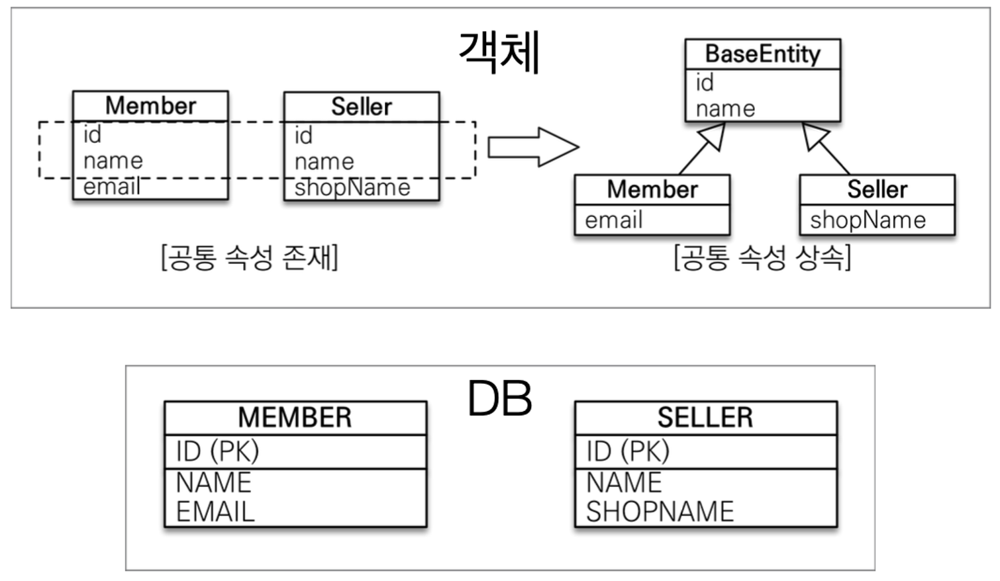

> 김영한님의 [JPA ORM 기본편](https://www.inflearn.com/course/ORM-JPA-Basic) 중 섹션 7. 고급 매핑 편을 듣고 정리한 내용입니다.

[이전 포스트](https://counttoten.github.io/posts/jpa-orm-5/)에서 상속 관계를 가지는 객체를 관계형 데이터베이스에 저장하기 위한 기법들에 대해서 공부하였다.
이어서 공통 속성을 가진 클래스의 상속 구조를 정의할 때 사용되는 @MappedSuperclass 어노테이션에 대해 알아보겠다.

## @MappedSuperclass

사실 @MappedSuperclass는 객체의 상속 관계와는 큰 관련이 있지 않다. 
@MappedSuperclass는 데이터베이스 내 여러 엔티티에서 공통으로 사용하는 속성이 존재할 때, 각각 정의하여 관리하는 귀찮음을 줄이기 위해 사용된다.

### 사용 예시


```java
@MappedSuperclass
public abstract class BaseEntity {
	private String id;
	private String name;
}

public class Member extends BaseEntity { ... }

public class Seller extends BaseEntity { ... }
```

위 예시와 같이 여러 엔티티 클래스에서 공통으로 사용하는 필드 및 매핑 정보를 슈퍼클래스에 정의하고 이를 상속받아 재사용할 수 있게 한다.

모든 테이블에 CreatedAt, CreatedBy, DeletedAt, DeletedBy, UpdatedAt, UpdatedBy 등의 정보가 필요한 상황이 있다면 @MappedSuperclass를 사용하기 적절하다고 할 수 있다.

### @MappedSuperclass 특징
- 실제 객체의 상속관계를 매핑하는 것이 아니다!
- 그러므로 @MappedSuperclass 어노테이션이 붙은 클래스는 엔티티가 아니다.
  - 따로 테이블이 생기지 않는다.
  - 직접 생성해서 사용할 일이 없으므로 추상(abstract) 클래스로 정의하는 것을 권장한다.
- 부모 클래스를 상속 받는 자식 클래스에 매핑 정보만 제공한다.
- 조회, 검색 불가
  - `em.find(BaseEntity)` 와 같은 메서드를 사용하기 어렵다.
