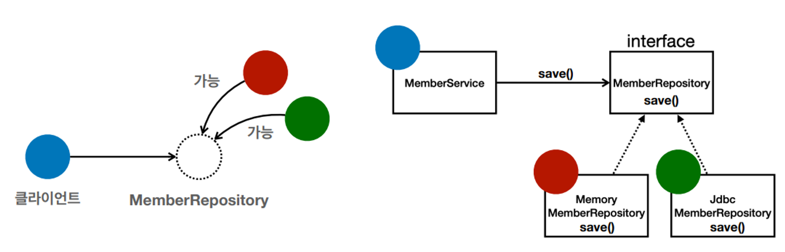

> 김영한님의 [스프링 핵심 원리 - 기본편](https://inf.run/kCYMv) 중 섹션 1. 객체 지향 설계와 스프링편을 듣고 정리한 내용입니다.

## ⭐ 좋은 객체 지향 설계의 5가지 원칙 (SOLID)

로버트 마틴(클린코드)이 정리한 좋은 객체 지향 설계의 5가지 원칙

- SRP (Single Responsibility Principle) : 단일 책임 원칙
- OCP (Open/Closed Principle) : 개방-폐쇄 원칙
- LSP (Liskov Substitution Principle) : 리스코프 치환 원칙
- ISP (Interface Segregation Principle) : 인터페이스 분리 원칙
- DIP (Dependency Inversion Principle) : 의존관계 역전 원칙

### SRP 단일 책임 원칙 (Single Responsibility Principle)

> 한 클래스는 하나의 책임만 가져야 한다.

- 중요한 기준은 변경
    - 변경이 있을 때 파급 효과가 적으면 단일 책임 원칙을 잘 따른 것이다.

### OCP 개방-폐쇄 원칙 (Open/Closed Principle)

> 소프트웨어 요소에는 **확장에는 열려** 있으나 **변경에는 닫혀** 있어야 한다.

- 다형성을 활용하는 코드
     

     ```java
        public class MemberService {
            private MemberRepository memberRepository1 = new MemoryMemberRepository();
            private MemberRepository memberRepository2 = new JdbcMemberRepository();
            
            memberRepository1.save(); // 빨간색
            memberRepository2.save(); // 초록색
        }
     ```
    - 인터페이스를 구현한 새로운 클래스를 만들어서 새로운 기능을 구현하고자 한다면?
        - 구현 객체를 변경하려면 클라이언트 코드를 변경해야 한다.
        - 위 코드는 원래 `MemberRepository` 사용했다가 추가 기능이 필요해서 `JdbcMemberRepository`를 구현한 코드다 → 결국 `JdbcMemberRepository`를 사용하도록 클라이언트 코드를 수정해야 한다.
        - **분명 다형성을 사용했지만 OCP 원칙을 지킬 수 없다..!**
    - 객체를 생성하고, 연관관계를 맺어주는 별도의 조립, 설정자가 필요하다

### LSP 리스코프 치환 원칙 (Liskov Substitution Principle)

> 프로그램의 객체는 프로그램의 정확성을 깨뜨리지 않으면서 하위 타입의 인스턴스로 바꿀 수 있어야 한다.

- 다형성에서 하위 클래스는 인터페이스 규약을 다 지켜야 한다.
- 예를 들어 자동차 인터페이스의 엑셀은 앞으로 가라는 기능을 뒤로 가게 구현하면 LSP 위반이다.

### ISP 인터페이스 분리 원칙 (Interface Segregation Principle)

> 특정 클라이언트를 위한 인터페이스 여러 개가 범용 인터페이스 하나보다 낫다

- 예시
    - 자동차 인터페이스 → 운전 인터페이스, 정비 인터페이스로 분리
    - 사용자 클라이언트 → 운전자 클라이언트, 정비사 클라이언트로 분리
    - 분리하면 정비 인터페이스가 바뀌어도 운전자 클라이언트에 영향을 주지 않음
- 인터페이스가 명확해지고, 대체 가능성이 높아진다.
- 실제 스프링도 정말 철저하게 매우 많이 쪼개져 있다!

### DIP 의존관계 역전 원칙 (Dependency Inversion Principle)

> 추상화(역할)에 의존해야지, 구체화(구현)에 의존하면 안된다.

- 클라이언트는 구현 클래스를 바라보지 말고, 인터페이스에 의존해야 한다.
- 객체 세상도 클라이언트가 인터페이스에 의존해야 유연하게 구현체를 변경할 수 있다! 구현체에 의존하게 되면 변경이 아주 어려워진다.
- [위 코드](#ocp-%EA%B0%9C%EB%B0%A9-%ED%8F%90%EC%87%84-%EC%9B%90%EC%B9%99-openclosed-principle)에서는 `MemberService`가 인터페이스에 의존하지만, 구현 클래스도 동시에 의존하고 있다.
    - `MemberService` 클라이언트가 구현 클래스를 직접 선택하고 있다.
        - `MemberRepository m = new MemoryMemberRepository();`
    - **DIP를 위반하는 것!!**
    - **다형성 만으로는 DIP를 지킬 수 없다.**

## 객체 지향 설계와 스프링

> 스프링은 다음 기술로 다형성 + OCP, DIP를 가능하게 지원한다.
{:prompt-callout}

- DI(Dependency Injection): 의존관계, 의존성 주입
- 스프링은 DI 컨테이너를 제공한다.
- 클라이언트 코드의 변경 없이 기능 확장이 가능하다.