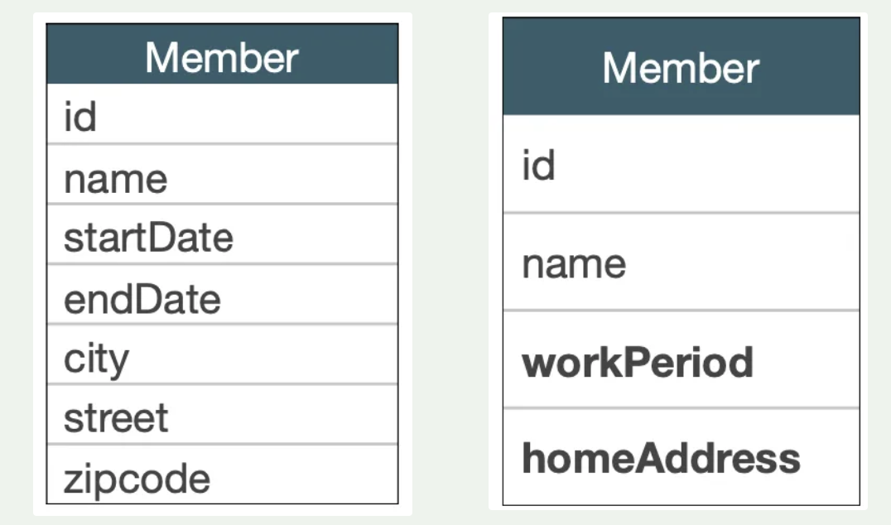
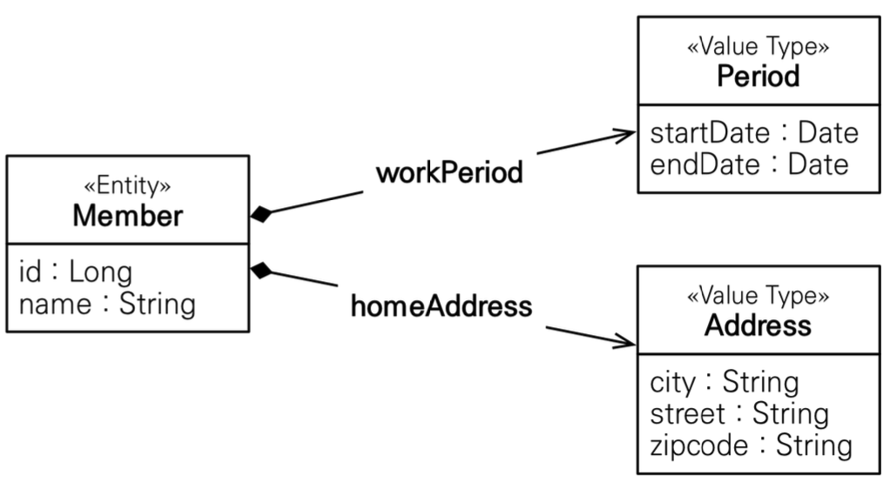
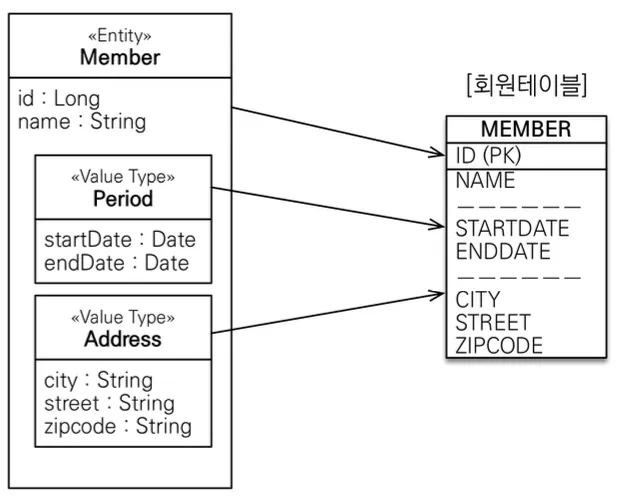
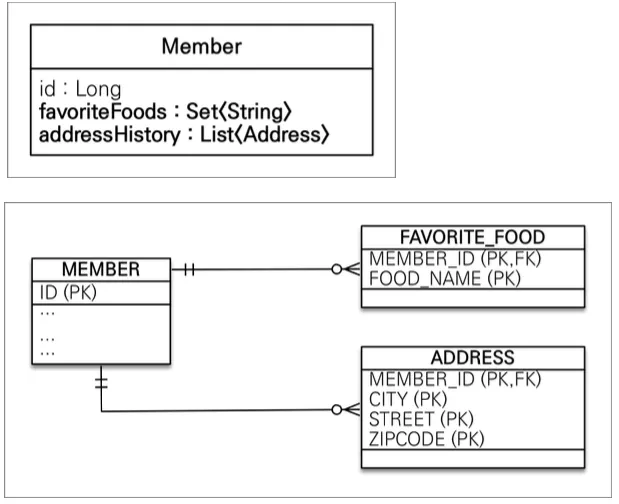
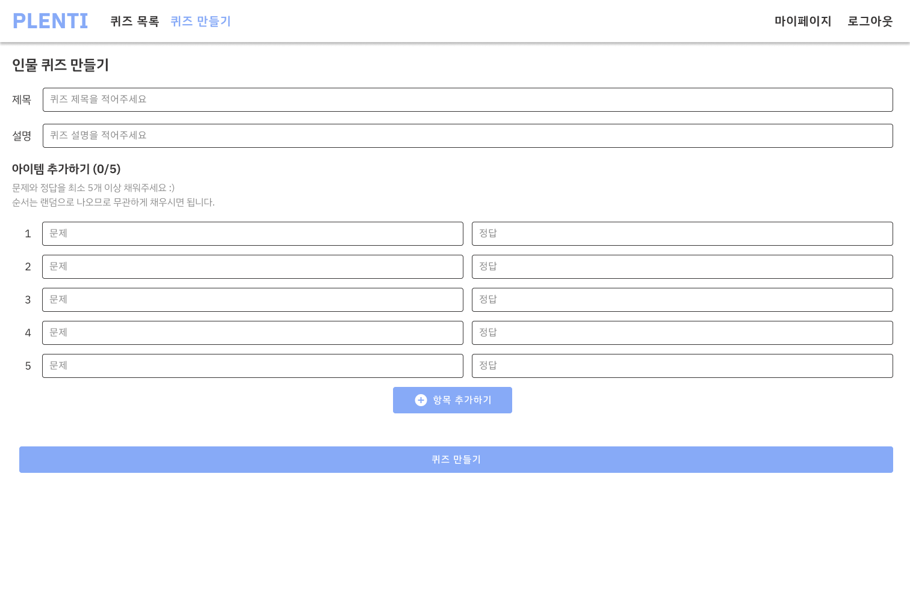
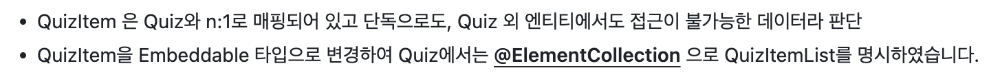
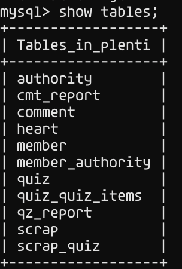
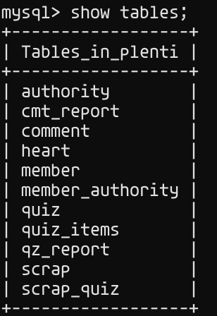

> 김영한님의 [JPA ORM 기본편](https://www.inflearn.com/course/ORM-JPA-Basic) 중 섹션 9. 값 타입 편을 듣고 정리한 내용입니다.

JPA의 데이터 타입은 엔티티 타입과 값 타입, 크게 두 종류로 나뉜다.

엔티티 타입은 `@Entity`로 정의하는 객체로, 데이터가 변해도 식별자로 지속하여 추적 가능하다.
반면 값 타입은 `int`, `Integer`, `String`처럼 단순히 값으로 사용하는 자바 기본 타입이나 객체를 포함한다. 이들은 **식별자가 없고** 값만 있으므로, **값이 변경되면 추적이 불가능**하다.

값 타입은 값 타입을 소유한 엔티티에 생명주기를 의존한다. 예를 들면 회원 엔티티를 삭제하면 이름, 나이 필드도 함께 삭제된다.

값 타입은 1) 기본 값 타입, 2) 임베디드 타입 (복합 값 타임), 3) 컬렉션 값 타입으로 분류된다.

# 값 타입 소개
## 기본 값 타입
자바 기본 타입(int, double 등), 래퍼 클래스(Integer, Long 등), String이 이에 해당한다.

## 임베디드 타입
좌표, 주소와 같은 새로운 값 타입을 직접 정의할 수 있는데, JPA에서는 그러한 값 타입을 임베디드 타입이라고 한다. 주로 기본 값을 모아서 만들어지기 때문에 복합 값 타입이라고도 한다.

### 임베디드 타입 도입 예시
회원 엔티티는 이름, <u>근무 시작일, 근무 종료일</u>, <u>주소 도시, 주소번지, 주소 우편번호</u>를 가진다. 이에 복합 값 타입을 도입하여 회원 엔티티는 이름, <u>근무 기간</u>, <u>집 주소</u> 를 가지도록 설계할 수 있다.





```java
@Entity
public class Member {
	@Id
	@GeneratedValue
	@Column(name="MEMBER_ID")
	private Long id;
	
	@Column(name="USERNAME")
	private String name;
	
	@Embedded
	private Period period;
	
	@Embedded
	private Address address;
}
```
```java
@Embeddable
public class Peroid {
	private Date startDate;
	private Date endDate;
	
	public Peroid() {}
}

@Embeddable
public class Address {
	private String city;
	private String street;
	private String zipcode;
	
	public Address() {}
}
```

### 임베디드 타입 사용법
- `@Embedded`: 값 타입을 사용하는 곳에 표시
- `@Embeddable`: 값 타입을 정의하는 곳에 표시

### 임베디드 타입의 장점
- 재사용이 가능하다.
- 한 엔티티 내에서 높은 응집도를 가진다.
- `Peroid.isWork()`처럼 해당 값 타입만 사용할 수 있는 의미 있는 메소드를 만들 수 있다.

### 임베디드 타입과 테이블 매핑


- 임베디드 타입은 엔티티의 값일 뿐이다.
- 임베디드 타입 사용하기 전과 후에 매핑하는 테이블은 같다!

## 컬렉션 값 타입


위 이미지와 같이 값 타입을 하나 이상 저장할 때 사용한다.

### 컬렉션 값 타입 사용방법
아래와 같이 사용할 수 있다.
```java
@ElementCollection
@CollectionTable(name="FAVORITE_FOOD", joinColumns = @JoinColumn(name="MEMBER_ID"))
@Column(name="FOOD_NAME")
private Set<String> favoriteFoods = new HashSet<>();
```
- `@ElementCollection`: 컬렉션 값 타입을 명시한다.
- `@CollectionTable`: 데이터베이스는 컬렉션을 같은 테이블에 저장할 수 없기 때문에 별도의 테이블을 만든다. 해당 테이블의 이름 등을 정의한다.

### 컬렉션 값 수정
컬렉션 값 중 하나를 수정하고 싶다면 통채로 바꿔야 한다.

```java
findMember.getFavoriteFoods().remove("치킨")
findMember.getFavoriteFoods().add("한식")
```

코드에선 하나의 값을 삭제하고 더하는 형식으로 짤 수 있지만, 실제 데이터베이스는 그렇게 작동하지 않는다. 실제 데이터베이스에서는 **값 타입 컬렉션에 변경이 발생하면 주인 엔티티와 연관된 모든 데이터를 삭제하고, 값 타입 컬렉션에 있는 현재 값을 모두 다시 저장**한다.

### 실무에서는 상황에 따라 컬렉션 값 타입 대신에 일대다 관계를 고려한다.
컬렉션 내의 값을 하나만 수정하는 일이 발생할 수 있는 상황에서는 컬렉션 값 타입을 쓰는 게 매우 불리하다. 

이럴 때는 일대다 관계를 위한 엔티티를 만들고, 여기에서 값 타입 사용하는 식으로 구현하는 게 좋다.
**영속성 전이(Cascade) + 고아 객체 제거**를 사용하면 부모 삭제 시 자식들이 자동으로 삭제되는 값 타입 컬렉션과 동일하게 작동한다.
이렇게 구현할 시 컬렉션 내의 값을 하나만 수정하기에 용이하다.

**식별자가 필요하고, 지속해서 값을 추적, 변경해야 한다면 그것은 값 타입이 아닌 엔티티로 만드는 것이 좋다.**

# 프로젝트에 사용한 값 타입 분석

실무에서는 컬렉션 값 타입 대신에 일대다 관계를 쓰는 것을 선호한다고 한다. 이전에 진행한 프로젝트에서 @Embeddable과 @ElementCollection을 사용한 기억이 있어, 이 곳에도 일대다 관계를 쓰는 게 더 적절할까 궁금하여 다시 설계를 들여다보려고 한다.

이전에 진행한 PLENTI 라는 프로젝트가 있다. 해당 프로젝트에서 @Embeddable과 @ElementCollection을 사용한 기억이 있는데, 그땐 JPA에 대해 완벽히 이해하지 못한 상태였다. 잘 적용한 사례인지 지금 분석을 해보고자 한다.

## 요구사항 분석 및 도입 이유 분석
PLENTI는 레크레이션용 퀴즈 생성 및 공유 사이트로 퀴즈 생성 및 조회와 관련해서 아래와 같은 요구사항들을 충족해야 한다.
1. 퀴즈 생성
   1. 퀴즈 생성 폼에서는 퀴즈의 종류를 선택한 후, 제목, 소개글, 썸네일 이미지, 문제 목록을 등록할 수 있다.
   2. 각 퀴즈는 5개 이상 20개 이하의 문제로 구성되어 있다.
   3. 각 문제는 (질문: 정답)의 쌍으로 이루어져 있다.
   4. 퀴즈의 종류에 따라 질문은 초성, 단어, 이미지 url을 나타내는 문자열이다.
   5. 정답은 문제의 정답을 나타내는 문자열이다.
   
2. 퀴즈 수정
   1. 퀴즈 수정 폼에서는 퀴즈의 종류는 수정할 수 없다.
   2. 제목 및 문제 목록을 수정할 수 있다.
3. 퀴즈 삭제 
   1. 퀴즈의 작성자는 퀴즈를 삭제할 수 있다.
   2. 퀴즈 삭제 시 그 내용을 전부 DB에서 지운다.
4. 퀴즈 재생
   1. 퀴즈 목록에는 퀴즈의 제목 및 썸네일이 뜬다.
   2. 퀴즈를 선택하여 재생할 시 해당 퀴즈의 문제들이 랜덤한 순서로 재생된다.
   3. 질문과 정답이 번갈아(질문 1 - 정답 1 - 질문 2 - 정답 2 - ..) 재생된다.

여기서 퀴즈(Quiz)와 문제(QuizItem)을 아래와 같이 설계하였다.

```java
// 생략
@Entity
public class Quiz extends Timestamped {

  @Id
  @GeneratedValue(strategy = GenerationType.IDENTITY)
  private Long quizId;

  @Column(length = 100, nullable = false)
  private String quizNm;

  @Column(length = 100, nullable = false)
  private String content;

  private String coverImg;

  private String category;

  @ManyToOne(fetch = FetchType.LAZY)
  @JoinColumn(name = "writer_id", nullable = false)
  private Member writer;

  @Builder.Default
  @ElementCollection
  private List<QuizItem> quizItems = new ArrayList<>();

  // 생략
}
```

```java
// 생략
@Embeddable
public class QuizItem {

  @NotNull
  @NotEmpty
  private String question;

  @NotNull
  @NotEmpty
  private String answer;
}
```

당시에 위와 같이 구현한 이유는 다음과 같다. (아래 사진은 PR의 일부를 캡처)


당시에도 이런 저런 블로그를 참고하면서 정한 설계이긴 하지만, 고민이 조금 덜 들어간 느낌이 있긴 하다. 지금 공부한 내용을 참고하여 좀 더 보충해보자면 컬렉션 값 타입이 적절한 이유를 아래와 같이 정리할 수 있다.
1. QuizItem이 Quiz 한 건에 종속되어 있다.
   1. Quiz와 동시에 생성되고 동시에 삭제된다.
2. QuizItem 독립적으로 사용할 일이 없다.
   1. 퀴즈 재생, 수정 시에 해당 퀴즈의 모든 문제를 조회하는 방식으로만 작동한다.
3. 퀴즈 수정 시 QuizItem을 통으로 갈아끼우는 것이 더 적절할 것이다.
   1. 퀴즈 수정 폼이 퀴즈 생성 폼과 똑같이 생겼기 때문에 문제 목록을 한꺼번에 수정하게 된다. 문제 한 건 한 건을 수정하는 일은 현재 요구사항에는 없다.
   2. 퀴즈를 수정하면서 문제 목록을 수정하면 QuizItem 목록에서 뭐가 변경되었는지 추적하는 것보다는 다 지우고 갈아끼우는 형식으로 작동하는 게 더 빠를 것이다.
   3. 또한 한 퀴즈 당 QuizItem 수가 최대 20건으로 제한되어 있기 때문에 크게 부담이 되지 않을 듯하다.

식별자가 필요하고, 지속해서 값을 추적, 변경해야 하는 상황이 아니다 보니 컬렉션 값 타입을 사용해도 괜찮을 것 같다. 다만 수정할 사항이 보이긴 한다.


## 개선할 점
Quiz 엔티티에 `@ElementCollection`으로 quizItems이 컬렉션 값 타입임을 명시해주고 있는데 `@CollectionTable` 애노테이션은 적용하지 않고 있다.
```java
@Builder.Default
@ElementCollection
private List<QuizItem> quizItems = new ArrayList<>();
```

`@CollectionTable`을 사용하는 것은 선택적이지만, 사용하는 게 좋은 것 같다.
아래와 같이 데이터베이스 테이블이 생성되어 명시적이지 않기 때문이다.



`quiz_quiz_item`과 같이 두 클래스의 이름을 언더스코어(_)로 이어서 표시하고 있다.

따라서 아래와 같이 따로 정의를 해주는 게 더 좋을 것 같다.

```java
@Builder.Default
@ElementCollection
@CollectionTable(name = "quiz_items", joinColumns = @JoinColumn(name = "quiz_id"))
private List<QuizItem> quizItems = new ArrayList<>();
```

위 코드를 적용시켜보면 아래와 같이 테이블이 생긴다.



## 분석 후기
이전에는 컬렉션 값 타입을 언제 도입해야 하는지도 모른 채, 여러 블로그 글을 참고해 “이런 방식이 좋다”는 이유로 무작정 도입했었다. 하지만 JPA에 대한 이론을 공부하고 나서 다시 보니, 더 깊이 고민한 후 도입했어야 했다는 생각이 든다.

특히 컬렉션 값 타입 중 일부가 자주 수정되는 상황에서 위와 같이 코드를 작성했다면, 성능상의 문제가 크게 발생할 수 있었을 것이다. 실제로 유저가 몰리기 전까지는 이러한 문제를 인지하지 못했을 것이며, 문제의 원인도 파악하기 어려웠을 것이다.

스프링은 개발자의 편의를 위한 수많은 애노테이션을 제공하지만, 각각의 사용법을 더 잘 이해하고 신중하게 도입해야겠다고 다시금 깨닫게 되었다. 앞으로도 이론 공부를 소홀히 하지 말자!