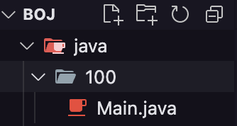
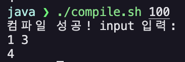
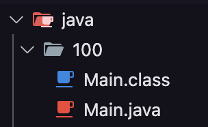

Java로 백준을 풀기 위한 환경 세팅을 진행하였다. 환경 세팅에 사용한 풀이 템플릿 생성 스크립트, 컴파일 스크립트를 공유하고자 한다.

원래 백준 문제들을 C++로 풀 때는 IDE의 도움을 최대한 안 받기 위해 Dev C++을 썼다. 코테 언어를 Java로 바꾸고 나서는 프로그래머스 문제들 위주로, 프로그래머스 편집기에서 풀었기에 자바 문제 풀이 환경을 세팅할 필요성을 못 느꼈다. 하지만 한 알고리즘을 잡고 그에 대한 여러 문제들을 풀어보기에는 백준이 더 적합한 것 같아, 자바 코드를 편하게 작성하기 위한 환경을 만들어 보고자 한다.

### 분석
처음이어서 일단 Visual Studio Code를 켜고, boj/java 폴더를 만들어 [1000번 문제](https://www.acmicpc.net/problem/1000) 풀이를 위한 1000.java 파일을 만들고 컴파일하고자 하였다. (코드는 [BOJ Help](https://www.acmicpc.net/help/language) 사이트에서 가져왔다.)

```shell
java ❯ javac 1000.java
1000.java:2: error: class Main is public, should be declared in a file named Main.java
public class Main{
       ^
1 error
```

백준 문제 제출 시에 class 이름을 무조건 `Main`으로 해야 한다길래 그대로 뒀더니 파일 이름도 *Main.java*로 설정하라고 한다.
Main.java 로 파일명을 변경한 후 `javac Main.java` 명령어를 실행하면 컴파일이 완료되고 *Main.class*가 생긴다.


나는 문제 번호로 파일을 관리하고 싶었고, 한 문제당 java 파일과 class 파일 두 개가 생기는 김에 그냥 문제 번호 이름으로 폴더를 만들어 그 밑에 Main.java를 만들고 컴파일 하고자 한다.

그리고 백준에서 요구하는 파일의 양식(Class 이름은 Main, 입력, 출력 방식)을 편하게 작성하기 위해 **template 폴더**와 그 밑에 양식을 담은 Main.java를 만들어서 그 폴더를 복붙해서 사용하고자 한다.

## 원하는 폴더 구조
```shell
/boj/java
├── /template
│   └── Main.java
├── /1000
│   ├── Main.java
│   └── Main.class
└── /1002
    ├── Main.java
    └── Main.class
```

### 템플릿 생성 스크립트
문제별 폴더를 편하게 생성하기 위해 bash 스크립트 **newps.sh**를 작성하였다.
```shell
#!/bin/bash

if [ -z "$1" ]; then
    echo "사용법: newps <문제 번호>"
    exit 1
fi

PROBLEM_NUMBER=$1
TEMPLATE_DIR="./template"
NEW_DIR="./$PROBLEM_NUMBER"

# ./문제번호 로 폴더를 생성한다.
mkdir -p "$NEW_DIR"

# 템플릿 폴더의 Main.java 파일을 문제 폴더에 복사한다.
cp "$TEMPLATE_DIR/Main.java" "$NEW_DIR/Main.java"

echo "$NEW_DIR 생성 완료"
```

실행하면 아래와 같이 폴더가 생긴다.




### 컴파일 스크립트
또 컴파일과 실행을 한 번에 할 수 있도록 bash 스크립트 **compile.sh**를 작성하였다.
```shell
#!/bin/bash

if [ -z "$1" ]; then
    echo "사용법: compile <문제 번호>"
    exit 1
fi

PROBLEM_NUMBER=$1
PROBLEM_DIR="./$PROBLEM_NUMBER" 

# 컴파일 수행
javac "$PROBLEM_DIR/Main.java"

if [ $? -eq 0 ]; then
    # 컴파일 성공 시 실행
    echo "컴파일 성공! input 입력:"
    java -cp "$PROBLEM_DIR" Main
else
    echo "컴파일 실패!"
fi
```

아래와 같이 실행하고, 컴파일에 성공할 시 클래스 파일이 생기며, 바로 실행되어 input을 입력할 수 있다.






template으로 쓸 적절한 Main.java는 다음 포스팅에서 구성하도록 하겠다.