<div style="display: flex; justify-content: space-between; gap: 10px">
  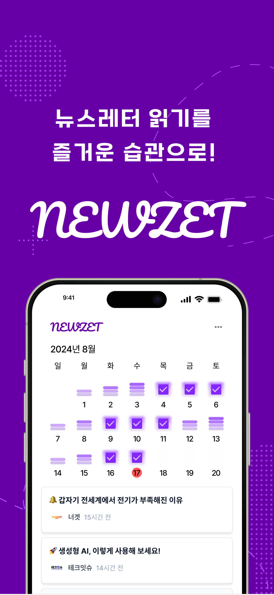
  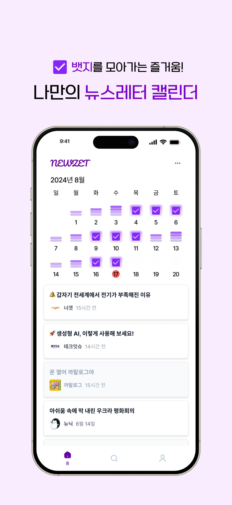
  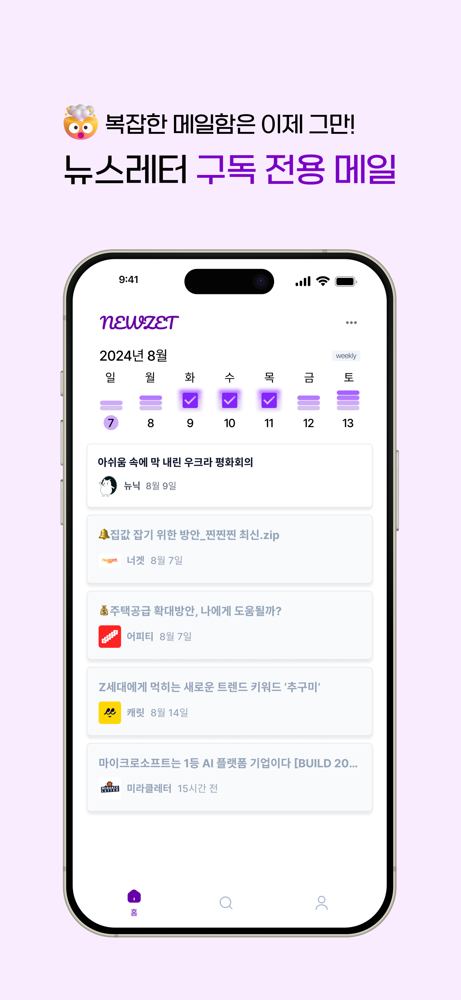
  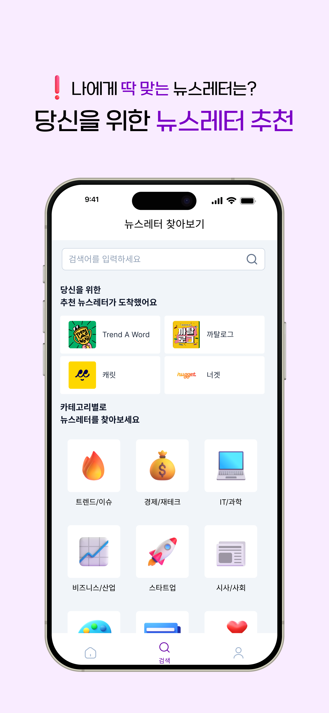
</div>

> 💌 복잡한 메일함에서 나와 뉴스레터를 편하게 관리할 수 있게 해주는 서비스, '뉴젯'은 현재 [구글 플레이스토어](https://play.google.com/store/apps/details?id=com.team3to1.newzet), [앱 스토어](https://apps.apple.com/kr/app/뉴젯-newzet/id6581484791)에서 만나보실 수 있습니다.

뉴젯을 개발하면서 메일 수신 시스템을 구축하기까지의 과정을 기록으로 남기고 회고하고자 한다.(거진 우리 팀이 겪은 무수한 삽질에 대한 이야기이다..) 추후 Gmail API를 활용하려는 이들, 혹은 메일 수신 시스템을 구축하려는 이들에게 도움이 되길 바란다!

## 메일 수신 시스템 구축 방법 선택: 새로운 메일 주소 제공 vs 기존 메일 연동

뉴스레터 발행자가 우리 서비스에서 직접 발행하는 것이 아니었기 때문에, 우리는 **메일로 전달되는 뉴스레터를 사용자들이 쉽게 볼 수 있도록 메일 수신 시스템을 구축**해야 했다.

이 과정에서 메일 수신 시스템을 구축하는 방법은 크게 두 가지로 나뉘었다. 1) **뉴젯 전용 도메인으로 새로운 메일 계정(예: user@newzet.me)을 제공**해 사용자들이 뉴스레터를 구독하도록 하는 방식, 2) **사용자가 기존에 사용하던 메일 계정(예: @gmail.com, @naver.com)을 등록**해 보던 뉴스레터를 뉴젯에서 확인할 수 있게 하는 방식. 

각 방식에는 장단점이 있었다. 새로운 메일 계정을 제공하는 첫 번째 방식은 뉴스레터를 처음 접하는 사용자들에게 자연스러운 접근을 제공하는 장점이 있었지만, 기존에 뉴스레터를 구독하던 사용자들은 기존 구독 내역을 새로운 메일 계정으로 다시 설정해야 하는 번거로움이 있었다.
반면, 두 번째 방식은 기존에 뉴스레터를 구독하던 사용자들이 별도의 재설정 없이 서비스에 가입만 하면 뉴스레터를 손쉽게 관리할 수 있다는 장점이 있었으나, 업무용 메일처럼 중요한 정보가 오가는 메일이라면 우리 서비스에 등록하는 것에 불편함을 느낄 수 있고, 외부 메일 서비스에 의존해야 한다는 단점이 있었다. 

구현 방식도 만만치 않았다.
새로운 메일 계정을 제공하려면 도메인을 구매한 후 메일 서버를 직접 구축하거나 서드파티 메일 서버를 활용해야 했다. 기존 메일을 연동하는 방식의 경우에는 각 메일 서비스에서 제공하는 API를 최대한 활용해 뉴스레터 메일만을 우리 서버로 옮길 방법을 찾아야 했다.

고민 끝에, **Gmail API를 활용해 구글 메일을 연동하는 방식**으로 구현하기로 결정하였다.
그렇게 결정하는 데에는 여러 요인이 작용했는데, 우선 Gmail API의 문서가 매우 자세하여 빠르게 구현할 수 있을 것 같았다. 또, Gmail API는 거의 무료로 이용할 수 있어 비용 효율적이었고, 나를 포함한 팀원 전체가 이미 구글 메일로 여러 뉴스레터를 구독 중이었기 때문에 이를 손쉽게 우리 서비스 연동하여 볼 수 있다는 점이 매우 좋았다.

서비스를 기획하면서 인터뷰한 사용자들도 "기존에 구독하던 뉴스레터를 번거로움 없이 연동하여 볼 수 있다면 좋을 것 같다"고 피드백해 주었다는 점 또한 결정에 큰 영향을 미쳤다. 또한, 해외의 [Meco](https://meco.app/)가 구글과 아웃룩의 메일을 연동하는 서비스를 제공하고 있었기에, 이를 참고하여 우선 Gmail을 연동하도록 지원하고, 추후 네이버 메일 연동과 같이 연동되는 메일을 더 추가하기로 하였다.

## Gmail API로 수신 시스템 구축
(혹시나 같은 방식으로 구현하려는 분이 있을까 해서 하는 말인데 따라하지 마세요... 이유는 아래...)

Gmail로 받아본 뉴스레터를 우리 서비스로 옮기기 위해서는 우선 구글 OAuth 로그인을 구현하고, 로그인 시 Gmail 관련 권한을 받아와야 했다. (관련 권한 전체는 [여기](https://developers.google.com/gmail/api/auth/scopes)에서 볼 수 있다.)

우리 서비스는 Gmail의 Filter, Label 기능을 활용하여 뉴젯에서 볼 **뉴스레터를 위한 전용 라벨**을 만들어 **뉴스레터 발행자들을 대상으로 필터**를 걸어 그들로부터 온 메일을 해당 라벨로 옮기도록 구현하고자 했다.

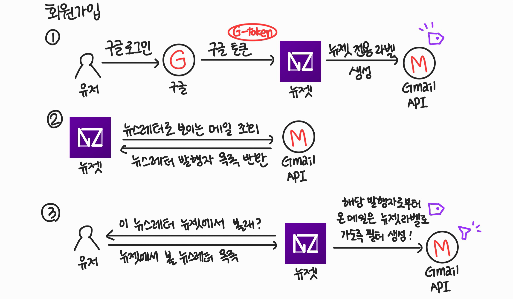

따라서 구글 로그인 시 아래 두 권한에 대한 동의도 받아오도록 추가하였다.
- /auth/gmail.modify
  - 한글 설명: 즉시 및 영구 삭제를 제외한 모든 읽기/쓰기 작업 대화목록 및 메일(휴지통을 건너뛰게 됨)
  - 영문 설명: Read, compose, and send emails from your Gmail account
  - 뉴스레터 메일을 읽기 위해 읽기 권한이 필요했고, 메일을 '받은 편지함'이 아닌 '뉴젯' 라벨로 가도록 하기 위해 쓰기 권한이 필요했다.
- /auth/gmail.settings.basic
  - 한글 설명: 기본 메일 설정을 관리합니다.
  - 영문 설명: See, edit, create, or change your email settings and filters in Gmail
  - 필터를 생성하고 관리하기 위해서 메일 설정 관리 권한이 필요했다.

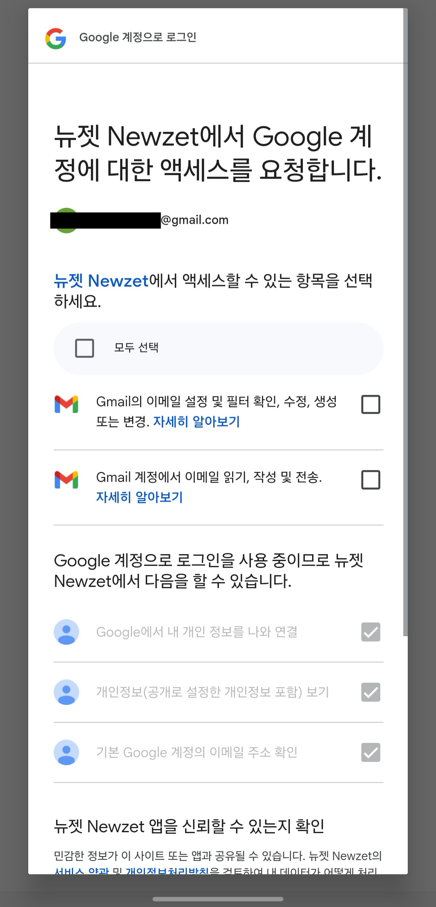

위와 같이 권한을 잘 받아 구글 메일을 활용하여 서비스에서 구글 메일과 연동하여 뉴스레터를 잘 볼 수 있도록 구축을 완료했다! 그러나 배포를 위해 심사를 맡기면서 문제가 생겼는데...

<div style="display: flex; justify-content: space-between; gap: 10px">
  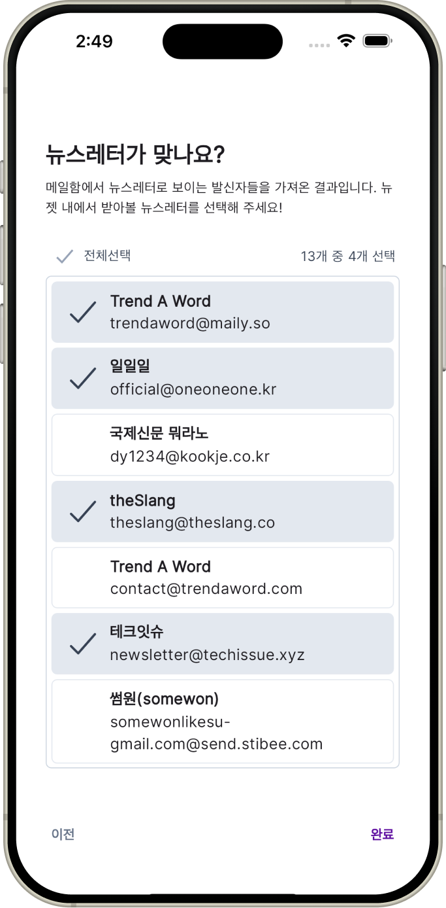
  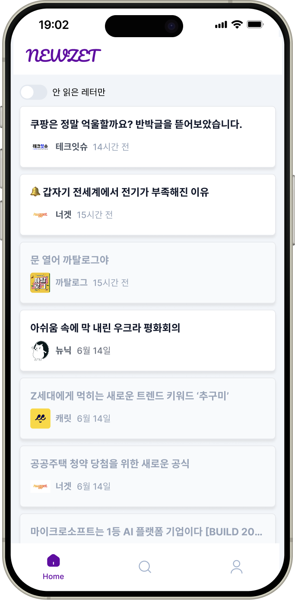
  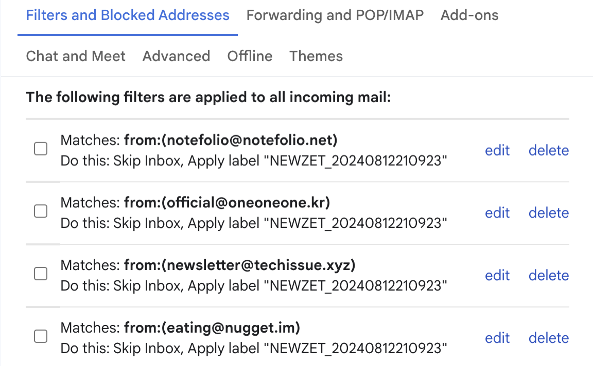
</div>


## 구글 인증 문제: CASA Tier 2의 벽
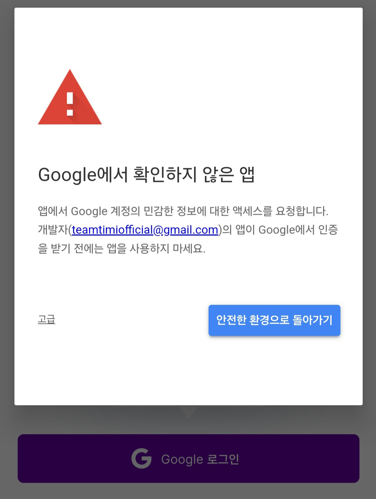

원래부터 구글 로그인 시 해당 Gmail 관련 권한이 민감한 권한이라며 '구글에서 확인하지 않은 앱'이라는 경고 화면을 띄우고 있었다. 아무래도 우리가 Gmail을 건드리기 위해 gmail.modify와 같은 권한을 받고 있는데, 이가 **민감한 정보이다 보니 인증이 필요**한 것 같았다.
구글 OAuth 로그인을 구현하는 게 처음이었던 우리는 구글 OAuth 콘솔에서 배포 직전에 앱을 프로덕션 상태로 돌리면 이 경고 메시지가 당연히 사라질 줄 알고 무시하고 개발을 진행했었다. (고급 > 그래도 로그인하기 를 클릭하여 로그인은 가능했었다...)

하지만 배포 전 프로덕션 상태로 돌린 이후에 추가로 구글에서 인증을 받아야 했고, 그 과정은 생각보다 느렸다. 사람이 직접 심사를 하는 것인지 메일로 소통하며 인증 과정을 통과해야 했는데, 메일 답장 주기가 최소 하루였다. 5일이 걸린 적도 있었다.
빠르게 배포하는 것이 목적이었던 우리는 일단 이 부분을 해결하는 동안 앱의 다른 기능들에 대한 심사를 먼저 받기 위해 앱 스토어에 배포 심사를 맡겼고, 당연하게도 구글 로그인 경고창부터 우선 해결하고 오라는 리젝을 받았다. 마음이 급해진 우리는 OAuth 심사를 통과하는 것을 최우선으로 두고 그들의 요구사항을 들어주기 위해 노력했다.

### 구글 OAuth 요구사항 1: 이용약관 및 개인정보 처리 방침을 뉴젯 홈페이지에 기재할 것

<div style="display: flex; justify-content: space-between; gap: 10px">
  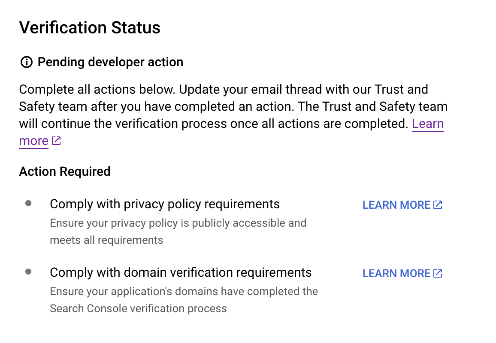
  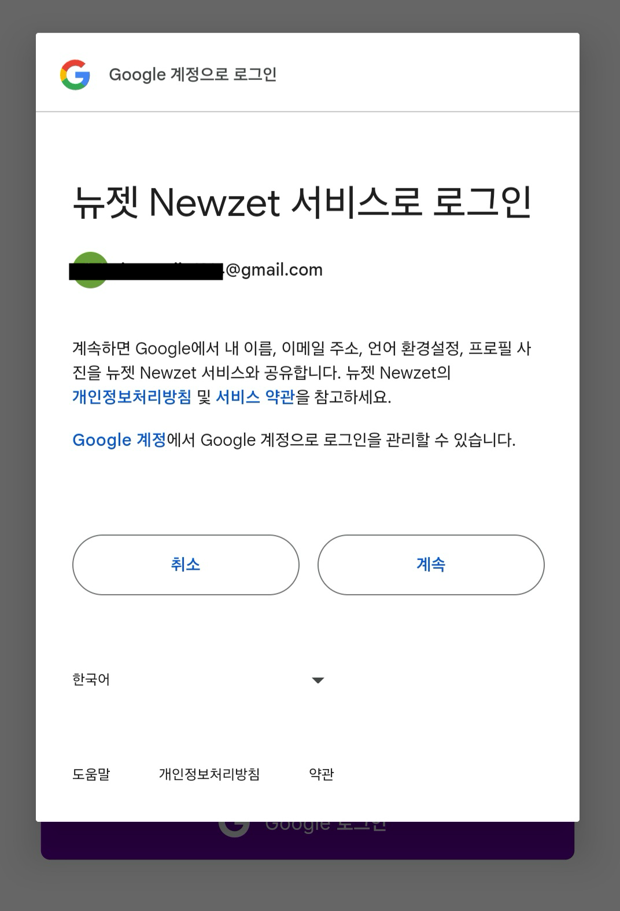
</div>

구글 인증 심사를 넣은 바로 다음 날 아침, 뉴젯의 이용약관 및 개인정보 처리 방침을 공개적으로 접근 가능한 곳에 기재할 것을 요청받았다. 구글 로그인 시 위 이미지와 같이 이용약관과 개인 정보 처리 방침에 대한 링크를 볼 수 있는데, 이것에 대한 피드백 같았다.

앱 서비스인지라 해당 문서들은 앱에서만 제공하고 있었고, 기재할 홈페이지가 없었던 우리는 노션에 약관을 적어 웹에 게시 후 해당 노션 링크를 원래 넣어뒀었다. 하지만 notion.so가 우리 소유의 도메인이 아니라는 점 때문에 거절 당한 것 같았다. 문서 두 개를 위해 홈페이지를 만들기에는 시간이 너무 오래 걸릴 것 같다고 판단한 우리는 꼼수를 부려 해당 이슈를 해결하고자 했다.

바로 도메인을 구매해 GET 도메인/policies와 같이 요청이 들어오면, 노션 페이지로 리다이렉트 되도록 하는 것이었다. 그렇게 하여 https://newzet.me/policies 와 같이 외부로 리다이렉트 되는 주소를 제출하였으나 바로 거절당했다.

결국 빠르게 HTML과 CSS로 간단한 정적 웹사이트를 만들어 이용약관과 개인정보 처리 방침을 게시했고, 드디어 통과할 수 있었다. (빠르게 심사를 통과하고 싶다면 꼼수는 부리지 말자..)

### 구글 OAuth 요구사항 2: 테스트 할 수 있는 앱을 제공할 것

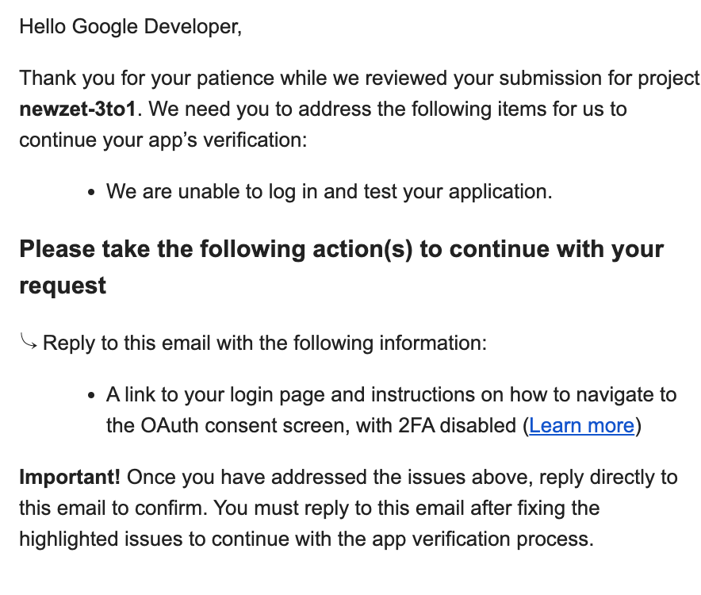
우리 서비스는 앱 서비스이기 때문에 그들이 우리 앱을 써보고 안전한지 파악할 방도가 없다며 로그인을 테스트 해 볼 수 있는 웹사이트 링크를 제공할 것을 요청받았다.

심사 신청 페이지에 '테스트 해 볼 실제 서비스를 제공하라'와 같은 언급이 없어서 아무 생각 없이 제출했었는데, 생각해보니 테스트를 해 볼 환경을 제공하는 건 당연한 것이었다. 왜 이런 점은 미리 알려주지 않는 걸까..

다만, 우리는 앱 서비스이기 때문에 웹사이트에서는 로그인이 불가능했기에, APK로 앱을 빌드한 후 APK 파일을 테스트용 구글 계정과 함께 메일로 전송하였다.

### 구글 OAuth 요구사항 3: 홈페이지에서 앱을 소개할 것

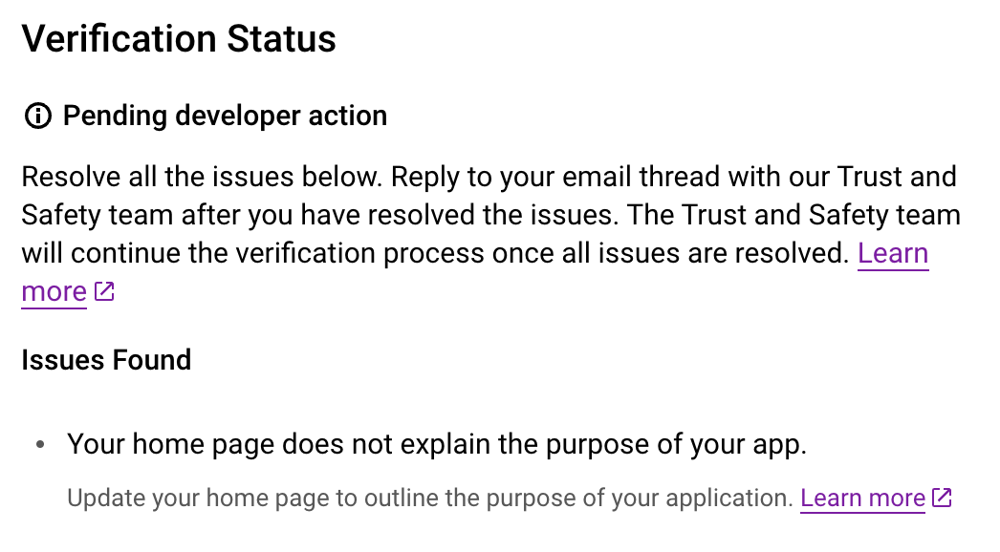

앱을 테스트하는 데 오랜 시간이 걸리는 것인지 3일 후 다음 답장을 받을 수 있었다. 또 거절이었다. 이번에는 홈페이지에 앱을 소개하는 내용이 없다며 앱의 목적을 소개하도록 홈페이지를 업데이트 할 것을 요구하였다.

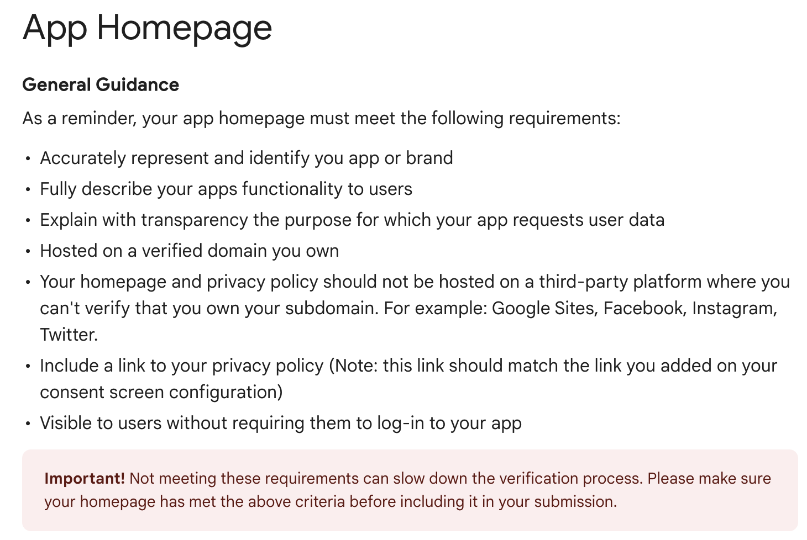

알고 보니 앱의 홈페이지에는 위의 내용이 전부 들어가야 했다. (자세한 내용은 공식 문서를 [참고](https://support.google.com/cloud/answer/13807376?hl=ko&sjid=14838484415677033297-AP)) 저 중 우리가 만족하지 않은 항목은 두 번째와 세 번째로 판단되었고, 우리는 가이드라인에 따라 위에서 대충 만든 약관용 홈페이지를 보충하여 업데이트 하기로 했다.

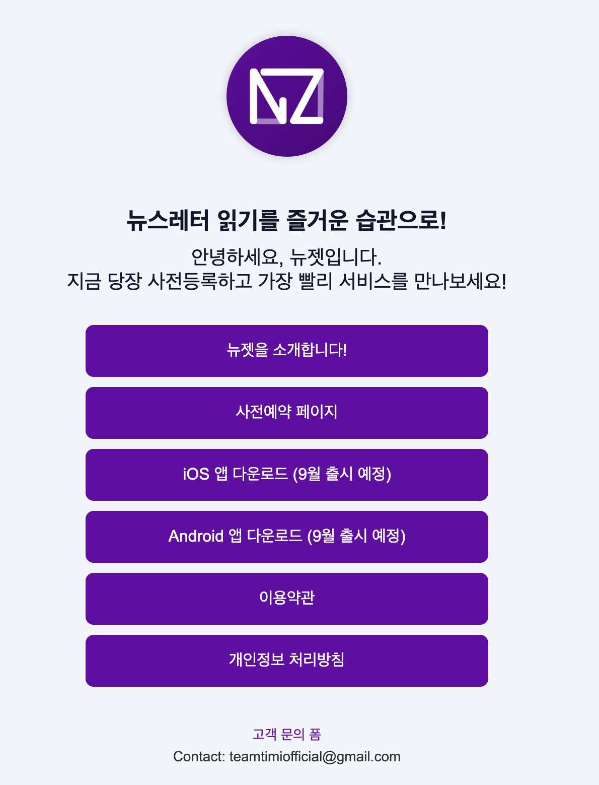

뉴젯이 어떤 기능을 제공하고, 왜 Gmail 권한들을 수집하고 있는지 그 작동 과정과 함께 잘 설명하였다. 그러면서 홈페이지도 링크트리처럼 조금 더 홈페이지스럽게 꾸몄다.

이전엔 거절된 사유만 파악해서 그것만 대충 해결하고 또 심사를 요청했는데, 심사 하나하나가 오래 걸리고, 리젝 사유도 너무 허무한 것들이다 보니 이제부터는 조금 신중히 대응해야겠다는 생각이 들었다. 미리 관련 사항들을 숙지하고 대응하기 위해 이번엔 관련 문서들을 전부 찾아서 읽고, 최대한 홈페이지 및 심사 요청 메일에 반영할 수 있도록 노력하였다.

### 구글 OAuth 요구사항 4: 요청한 권한들이 정말 필요한 최소한의 권한인지 다시 확인할 것

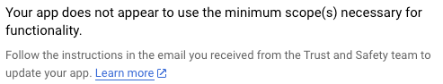

현재 요청하는 Scope는 "/auth/gmail.modify", "/auth/gmail.settings.basic" 두 가지이다. 하지만 "/auth/gmail.modify"는 정말 큰 권한이기에 이 Scope 대신 /"auth/gmail.send"와 "/auth/gmail.labels"를 사용할 것을 제안했다.

제안 받은 두 권한으로 뉴젯의 모든 기능이 되는지 확인 후 답장할 것을 요청받았고, 그래서 새로운 Google Cloud 프로젝트를 만들어 해당 Scope로 테스트를 진행했다. 

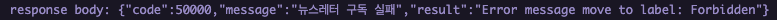

그 결과, gmail.send와 gmail.readonly로는 메시지를 특정 라벨로 옮기는 것이 불가능하다는 결론을 내릴 수 있었다. 따라서 아래와 같이 답장을 보냈다. (영어 표현이 서툰 영어 표현은 이해 바랍니다..)

```
Unable to use narrower scopes

I tested the app with "gmail.send" and "gmail.labels" as you guided.
But it didn't work for my app.

I also tested "gmail.readonly" with "gmail.labels", but that also didn't work.

Our app provides: "Move your newsletters from your inbox to our app!"

How we do that:
1) We create a label named "Newzet-timestamp" in gmail.
2) We search the user's inbox for newsletters by "mailed-by and from properties"
3) Then we make filters for newsletters' domains.
4) Then we move the previous newsletters from the inbox to the label we created at process 1. <- We need the gmail.modify here.

I developed this process by following the gmail api guidelines.
In Gmail API > Manage mailboxes > Labels > Add or remove labels to messages, it says to use messages.modify and it requires "https://mail.google.com/" or "https://www.googleapis.com/auth/gmail.modify".

And we are also deleting the label "UNREAD" when the users read their newsletters, so we need this messages.modify API.

Can you go over our project again?

Thank you.
```

### 구글 OAuth 요구사항 5: CASA Tier 2 보안 심사를 통과할 것

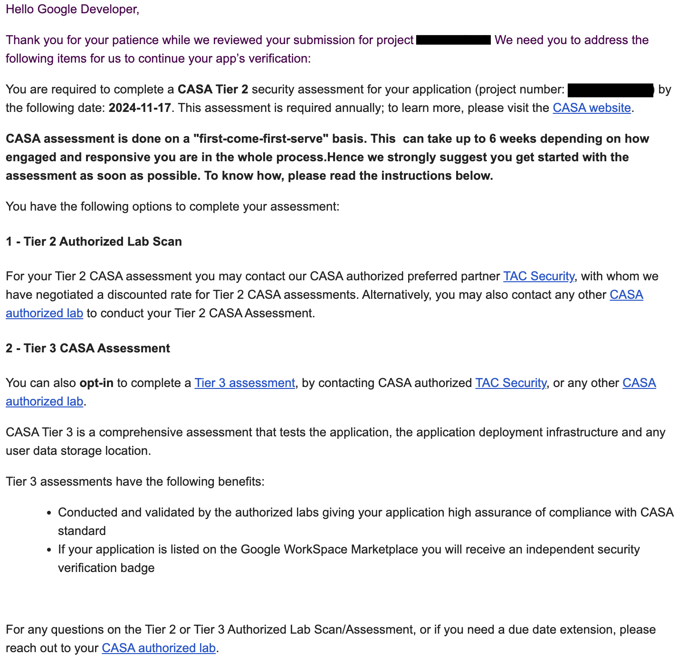

이젠 정말 마지막인 줄 알고 승인을 기다렸으나, 다음 단계가 있음을 안내받았다.

바로 **CASA Tier 2 보안 심사**를 통과할 것.

메일에서 언급하는 6 weeks에 충격을 받고 이게 도대체 무엇인가 하고 찾아봤는데 통과하기가 **매우매우 어려운**(reddit에서 많은 이들이 3달 걸린다, 아직도 못했다 와 같은 소리를 하고 있었다), **매년 진행**해야 줘야 하는, **공짜로 할 방도가 없는**(최소 540$이고, 올해 초까지는 self-scan으로 돈을 안 들이고 할 수 있던 것 같으나, 이제는 그 방법을 지원하지 않는다고 한다) 보안 심사였다.

프로젝트 활동비가 꽤 많이 남아있어 비용적인 부분은 상관없었으나, 심사 통과까지 얼마나 걸릴 지 모르겠다는 점 때문에 심사를 맡기기 망설여졌다. 우리는 소프트웨어 마에스트로라는 기간에 맞춰 최소한 10월 초까지는 배포를 완료하고 그 다음 단계를 진행해야 하는데, 어쩌면 6주라는 기간을 이 보안 등급을 통과하는데 전부 사용해야 할 수도 있었다.

## 결국... 구글 메일 관련 기능 제거 및메일 수신 시스템 교체

결국.. 멘토님들의 조언과 팀원들과의 충분한 논의 끝에 지금이라도 빠르게 **구글 메일 연동을 빼고** 제일 처음에 고민했던 **자체 도메인의 메일 계정을 제공하는 방식**으로 가기로 결정했다.

*6주는 최대 기간이고 보안 심사를 3일만에 통과할 수도 있지 않느냐*는 의견도 있었지만, 지금까지 만든 기능이 아까워 그런 불확실한 길을 택하는 게 망설여졌다. 또한 우리 서비스는 개인 개발자가 만든 앱이기에 사업자 등록증 같은 게 없었고, 그런 개인이 CASA 보안 심사를 통과할 수 있는지 그 자체에 의문이 들어 CASA 심사에 도박을 걸어보지는 못했다.

기존 메일과의 연동을 통해 확실히 더 많은 편의를 제공할 수 있는 건 맞다고 생각하여 관련 코드를 지우면서 아쉽고 씁쓸했다. 백엔드 로직의 절반 이상이 날아갔고 데이터베이스도 다시 설계해야 했다. 왜 미리 구글 로그인의 경고창에 대해 알아보지 않았을까 후회를 많이 했다.

구글 OAuth 인증이라는 예상치 못한 이슈를 만나 약 3주를 여기에 머물러 있던 것 같다. 심사 통과를 위해 최선을 다했으나 결국 통과하지 못했다는 점 또한 실패의 기억으로 남을 것 같다.

그래도 아직 뉴스레터 관리 서비스를 구축할 다른 방식이 남아있었다..! 그래서 다시 한 번 힘을 내서 빠르게 개발을 해보자고 팀원들과 으쌰으쌰 하였다. 글이 길어져 그에 대한 내용은 다음에 이어서 쓰겠다.