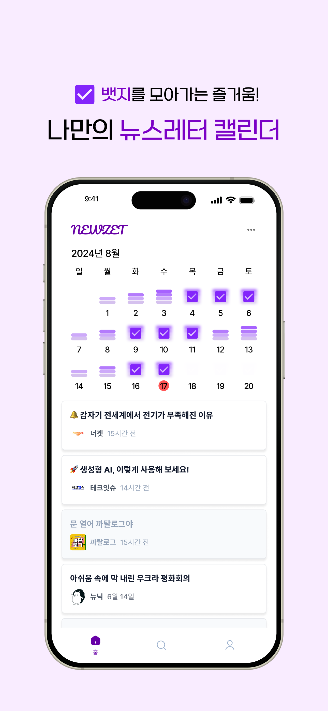

  
  
  
  

> 💌 복잡한 메일함에서 나와 뉴스레터를 편하게 관리할 수 있게 해주는 서비스, '뉴젯'은 현재 [구글 플레이스토어](https://play.google.com/store/apps/details?id=com.team3to1.newzet), [앱 스토어](https://apps.apple.com/kr/app/뉴젯-newzet/id6581484791)에서 만나보실 수 있습니다.

> [이전 포스트](https://counttoten.github.io/posts/newzet-mail-system-1/)에서 외부 메일 연동 기능을 개발하다 어려움을 겪고 기능을 제거하기까지의 과정을 공유했습니다.

시간 내에 외부 메일 연동을 구현하는 것이 어려워지면서, 우리는 자체 도메인의 메일 계정을 제공하는 방식으로 다시 방향을 바꾸게 되었다.

이번 글에서는 자체 도메인 메일 계정을 제공하는 시스템을 구축하는 과정에서의 의견 충돌과, 우리가 Amazon SES를 선택하고 이를 구현한 방법을 공유하고자 한다.

## 자체 도메인을 활용한 메일 수신 시스템 구축 방법 선택: 직접 구현 vs 서드 파티 활용

자체 도메인(@newzet.me)로 발송되는 뉴스레터 메일을 관리할 수 있는 시스템을 어떻게 구축할 수 있을까 팀원들과 이야기를 나누었다.

우리가 중점으로 둔 것은 **얼마나 빠르게 개발을 할 수 있는지**와 **최소한의 비용으로 유지가 가능한지**였다. 우선, 소프트웨어 마에스트로의 기간이 얼마 남지 않았는데 기본 기능인 '뉴스레터 메일 분리'부터 다시 개발해야 했으므로, 구현 난이도가 낮아야 했다. 또, 우리는 뉴젯 서비스를 최대한 오래 유지하고 싶어 저비용 설계를 위해 서버도 supabase의 무료 플랜을 활용하여 유지하고 있는만큼, 메일 서버 또한 최소한의 비용으로 설계하고 싶었다.

조사해 본 결과 여러 방법이 있었다.
1. 자체 메일 서버 구축  
    메일 수신을 위한 전용 가상 서버의 OS에 이메일 서버 소프트웨어를 설치하고 SMTP 서버를 구성하고 보안 인증서 등을 직접 설치하여 자체 메일 수신 서버를 구축하는 방법이 있었다.
    다만 이 방식은 멘토님께서 반대하셨는데, 메일 프로토콜과 관련 보안 설정들에 대한 도메인 지식이 많이 필요하며, 메일 누락 등의 이슈가 생길 수도 있다고 하셨다. 안정적인 메일 서버를 개발하다가 시간이 다 갈 수 있다는 현실적인 조언에 포기하게 되었다.
2. 메일 호스팅 서비스 사용  
    알아보니 Zoho Mail, Yandex, NameCheap 등의 서비스에서 자체 도메인으로 유저당 메일함을 만들어주는 호스팅 서비스를 제공하고 있었다.
    관련 API 문서도 잘 되어있어서 Gmail API와 비슷한 방식으로 빠르게 구현할 수 있을 것 같았다.
    다만 이는 소규모 회사의 비즈니스 메일을 쉽게 구축하는 것을 도와주기 위한 서비스로 보였다. 메일 수신뿐만 아니라 메일 발송 시스템 또한 제공했는데, 그래서 그런지 가장 비용이 낮은 서비스가 유저당 한달에 1$를 내야했다.
3. 메일 수신 특화 서비스 사용  
    메일 수신 만을 쉽게 다룰 수 있도록 도와주는 서비스도 있었다. MailSlurp, CloudMailin과 같은 개발자를 위한 이메일 API 서비스들 몇 개를 발견할 수 있었는데, 이들은 합리적인 비용으로 이메일 수신 서버를 구축할 수 있도록 해준다.

3번째 방법이 가장 쉽고 빠르게, 그리고 비용 합리적으로 구축할 수 있을 것 같았지만, 알아보니 그것 또한 애매했다. 조사한 서비스 모두 Inbound 메일 수에 비례하여 가격이 책정되어 있었다.

우리 서비스에서 뉴스레터를 적극적으로 소비하는 이들이 **하루에 뉴스레터 아티클 3개**를 수신한다고 가정하자.
주로 주말에는 뉴스레터가 오지 않는다는 점과, **목표 MAU 2000**을 기준으로 뉴젯 도메인의 **월별 인바운드 메일 개수**를 계산하면 아래와 같다.

$3 * 22 * 2,000 = 132,000$

메일 수신 특화 서비스를 사용하면 매달 25만원 정도의 비용 지출이 예상되는 상황이었다. 탈퇴하지 않고 이탈하는 사용자의 메일을 일일히 추적해 뉴스레터 수신 거부를 할 수도 없는 노릇이니 이 비용은 서비스를 종료하는 날까지 유지된다는 점 또한 부담이 되었다.

*"프로젝트 활동비는 많이 남아있고, 1000명의 사용자를 얻는 시나리오도 지나치게 긍정적이다. 일단 빨리 개발하는 게 먼저이다."* vs *"프로젝트 기간이 끝나고 유지가 99% 확률로 불가능하기 때문에 다른 방법을 찾아보거나 차라리 이전에 포기했던 CASA Tier 2 보안 심사를 통과하려 노력하는 게 더 좋을 것이다"*로 팀원 내에 의견 충돌이 있었고, 우리는 좀처럼 결정을 내리지 못했다.

## Amazon SES 서비스 조사
빠르게 자체 도메인을 제공하는 방법으로 다시 개발하자는 의견이었던 나는 팀원들을 설득하기 위해 유지 가능한 시스템을 구축할 방법에 대해 찾아보기 시작했다. 그러다 Amazon SES를 메일 수신 서버로 쓰는 방법을 알게 되었다.

처음 프로젝트를 구상할 때, 메일 서버를 구축하는 방법을 고민하면서 Amazon SES에 대해 접한 적이 있었다. 그 당시에 조사했을 때는 메일 발송 시스템으로 활용된다는 글이 대부분이었고, 공식 문서 역시 발송에 초점이 맞춰져 있어, 다른 방법들이 우리에게 더 맞을 것이라고 판단해 넘어갔었다. 하지만 다시 문서를 천천히 검토한 결과, SES가 메일 수신에도 활용될 수 있다는 점을 발견하게 되었다.

SES도 수신한 메일 수에 비례해 요금이 부과되지만, 우리가 조사했던 메일 수신 특화 서비스에 비해 비용이 약 10% 수준에 불과했다. 위에서 계산한 대로 매달 약 13만 건의 메일을 수신할 경우, 메일 서버 운영 비용이 약 2만원 정도로 매우 저렴하게 유지할 수 있었다.

이제 남은 문제는 개발 난이도였다. 빠른 개발이 가능하다는 점을 팀원들에게 설득해야 했기에, Amazon SES의 [Setting up email receiving](https://docs.aws.amazon.com/ses/latest/dg/receiving-email-setting-up.html) 문서를 참고하여, 이전에 구매해 둔 도메인을 이용해 실제로 메일을 수신할 수 있도록 SES를 구성해 보았다.

> 가이드가 들어가면 글이 지나치게 길어질 것 같아 SES를 구성하는 방법에 대해서는 추후 따로 블로그 글을 작성하여 첨부하도록 하겠습니다.

여기까지 구축하는 데 2시간이 채 안 걸렸고, 여기서 더 처리할 것은 1) S3 버킷에 저장된 메일을 우리 서버로 보내 2) 어떤 유저에게 온 메일인지, 어떤 뉴스레터가 보낸 메일인지 분석 후 3) 해당 유저의 아티클로 저장 후 4) 유저에게 뉴스레터 도착 알림을 주는 것이었다.

## 메일 수신 서비스 구축
팀원들과의 논의 끝에, **Amazon SES를 활용하여 메일 서버를 빠르게 구축**하기로 결정했다. 기존 백엔드 로직과 데이터베이스는 거의 사용할 수 없는 상태였기 때문에, 새롭게 데이터베이스 스키마를 설계하고 기존 로직에서 재사용할 수 있는 코드만 남기고 서버를 처음부터 다시 개발했다. 이는 초기에는 예상하지 못했던 대대적인 수정이었지만, 더 나은 구조와 확장성을 확보할 수 있는 기회로 삼았다.

위는 뉴젯의 시스템 구성도이다. 메일을 수신하면 Amazon SES에서 메일을 S3 버킷에 저장 후 Lambda를 활용하여 뉴젯 서버에 S3 버킷 주소를 보낸다.
뉴젯 서버는 해당 S3 버킷의 리소스를 받아와 메일을 디코딩하여 어떤 뉴스레터가 어떤 유저에게 왔는지 파악하여 DB에 아티클 정보를 저장하고 본문은 내부 Storage에 저장한다.
그 후 FCM에 메일 도착 알림을 보내어 유저가 뉴스레터를 볼 수 있도록 한다.

이를 최우선 작업으로 잡고 **이틀만에 개발을 완료**할 수 있었고, 드디어 뉴젯 서비스의 기본 뼈대가 되는 메일 수신 시스템을 완성하였다.

## 회고
한 달 동안 공들여 개발한 Gmail 관련 기능을 모두 제거하는 것은 매우 뼈아픈 결정이었다. 특히, Gmail API에 대해 충분히 알아보지 못해 시간과 노력이 낭비된 것 같아 아쉬움이 남는다. 자체 메일 도메인 제공 서버를 구축하면서 "처음부터 이렇게 했어야 했나" 하는 생각도 들었지만, 지금 돌이켜보면 외부 메일 연동을 시도하지 않았다면 그 어려움을 알지 못했을 것이고, 공짜로 사용할 수 있었던 API에 대한 미련도 남았을 것 같다.

이번 프로젝트에서 Google OAuth 심사를 통과하기 많은 노력을 기울였으나 결국 포기하게 된 경험을 통해, 새로운 기술을 도입할 때는 충분한 사전 조사와 실제 배포 상황까지 고려한 테스트가 얼마나 중요한지 깨달았다. 앞으로는 새로운 API나 기술 스택을 적용하기 전, 면밀한 검토와 철저한 테스트를 거쳐야겠다. 실제로 이번에 Amazon SES를 도입하기 전에 개인 도메인으로 충분히 테스트 해 본 덕분에, 전체 프로세스를 신속히 파악할 수 있었고, 뉴젯 도메인에도 원활히 적용할 수 있었다.

지메일 연동 모듈을 제거하고 백엔드 코드를 다시 작성하면서, 재사용성이 높은 설계에 대해 다시 한번 고민해 볼 수 있었다. 처음에는 모든 코드를 다시 작성해야 한다는 생각에 막막했지만, 의외로 빠르게 작업을 끝낼 수 있었다. Controller, Service, Repository로 구조를 나누어 코드를 작성했던 덕분에, Controller와 Repository는 거의 변경할 필요가 없었다.
기존에 짰던 복잡했던 지메일 관련 서비스 로직을 제거하면서 Service 코드 또한 훨씬 간결해졌다. 결국 더 나은 구조를 확보한 것 같아 만족스럽다.

의사 결정 과정에서 팀원들과의 의견 차이도 있었지만, 모두가 더 나은 결과를 위해 적극적으로 움직여 시스템을 성공적으로 완성할 수 있어서 고마웠다. 그 과정에서 서로가 생각하는 프로젝트의 궁극적인 형태에 대해 더 깊이 있게 이야기를 나눌 수 있었고, 이후에도 유지 보수를 지속하며 프로젝트를 발전시키자는 이야기를 나눌 수 있어서 좋았다.

배포 직전에 마주한 예기치 않은 상황에서도 신속히 대처할 수 있는 능력을 기를 수 있었던 것 같다. 앞으로는 리스크 관리를 더욱 철저히 하고, 예상치 못한 문제에 더 빠르게 대응할 수 있도록 노력해야겠다.