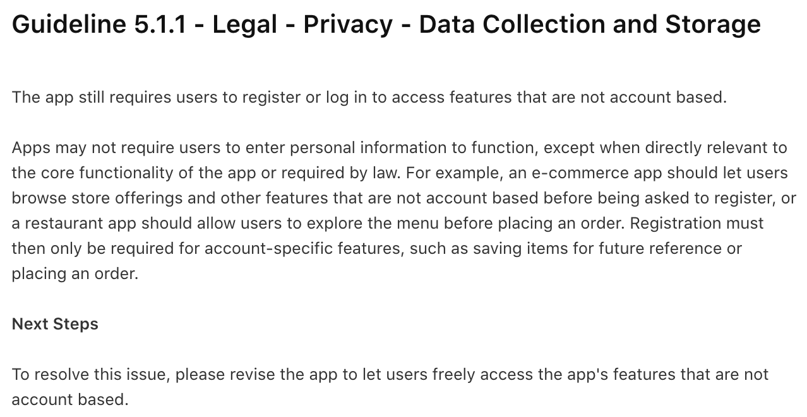
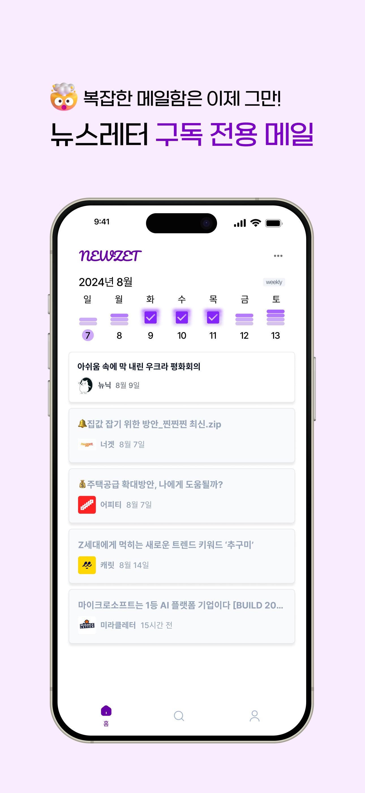

앱 스토어 배포 심사 과정 중 아래와 같은 이유로 거절 당했다.
> Guideline 5.1.1 - Legal - Privacy - Data Collection and Storage <br/>
> The app requires users to register or log in to access features that are not account based.


우리 앱에는 뉴스레터 탐색 및 추천 기능이 존재한다.
뉴스레터를 구독하기 위해 어떤 뉴스레터가 있는지 검색하고, 그에 대한 정보를 간단하게 볼 수 있는 페이지들이 있는데, 사실 이 부분에 로그인이 필요한 게 아닌 것은 맞다.

그러나 앱을 처음 실행 시에 일단 로그인부터 시키고 있었고, 그렇기에 앱 심사를 통과하지 못한 것 같다.
<div style="display: flex; justify-content: space-between; gap: 10px">
  
  
  
</div>

## 우회 시도
앱 심사에서 알려준 대로 유저가 로그인 없이 해당 기능을 자유롭게 사용할 수 있도록 바꾸기 위해서는 앱의 라우팅 및 동작 방식 자체를 완전히 바꿔야 했고, 우리는 그 방식이 마음에 들지 않았다. 일단 인증 상태를 관리하는 로직을 완전히 바꿔야 해 개발 시간이 많이 소모될 것 같았고, 더 큰 이유는 사용자 경험이 안 좋아질 것 같다는 것이었다.


뉴젯의 핵심 기능은 메인 페이지에 있는, 뉴스레터 읽기 기록을 관리할 수 있는 캘린더인데 이는 유저의 읽기 기록 기반으로 작동하기 때문에 무조건 로그인을 필요로 한다. 우리 앱을 처음 사용하는 사용자에게 메인 페이지에서 캘린더가 아닌 빈 화면을 보여주는 게 이상하다고 판단하여, 일단 우회책을 적용해보기로 하였다.

### 시도 1: 해당 페이지를 로그인이 필요한 기능으로 만들기
먼저 생각할 수 있었던 방법은 뉴스레터 탐색 및 추천 페이지를 로그인이 필요한 페이지로 만들어버리는 것이었다.
다만 기존의 탐색 기능에는 도저히 로그인이 필요할 만한 기능을 붙일 수 없어서, 위에 사용자 관심사 기반 뉴스레터 추천 항목을 추가했다.


### 시도 2: 인트로 화면 만들기
같은 사유로 리젝된 팀 중에 로그인 하기 전, 어떤 기능을 가지고 있는지 소개하는 인트로 페이지를 보여주는 방식으로 해당 심사를 통과하였다고 알려주었다. 그래서 우리도 기능을 소개하는 인트로 화면을 도입하기로 했다.

| 인트로 화면 1                                                        | 인트로 화면 2                                                        | 인트로 화면 3                                                        | 로그인 화면                                                        |
| -------------------------------------------------------------------- | -------------------------------------------------------------------- | -------------------------------------------------------------------- | ------------------------------------------------------------------ |
| {: width="200"} | {: width="200"} | {: width="200"} | {: width="200"} |


### 결과: 거절
위 두 방법을 동시에 도입하여 재심사를 요청하였으나, 거절 당했다. ~~"still" require이라니.. 마음이 아프다~~



## 해결: 로그인 없이도 앱 내 뉴스레터 검색 기능을 사용할 수 있도록 수정
어쩔 수 없이 로그인 없이도 뉴스레터 페이지를 볼 수 있도록 앱을 수정하기로 하였다.

### 클라이언트: user 존재 여부에 따라 다른 컴포넌트 띄우기
Singleton으로 `User? user` 값을 들고 있도록 했다.
Supabase의 `Stream<AuthState>`을 듣고 있도록 하여 tokenRefreshed, signin, signout 상태에 따라 user 값을 적절히 변경하도록 로직을 짜야했다.

또한 앱 진입 시 유저 세션이 존재하지 않으면 바로 login screen을 띄우고 있었는데, 처음부터 home screen을 띄우고, user값이 null이면 로그인해야 볼 수 있는 컴포넌트 대신 다른 컴포넌트를 띄우도록 수정했다.

| 홈 - 로그인 X 1                                                      | 홈 - 로그인 O                                                        | 검색 - 로그인 X                                                      | 검색 - 로그인 O                                                      |
| -------------------------------------------------------------------- | -------------------------------------------------------------------- | -------------------------------------------------------------------- | -------------------------------------------------------------------- |
| {: width="200"} | {: width="200"} | {: width="200"} | {: width="200"} |

캘린더 화면을 아예 비워둘 수는 없어서 가입 시 볼 수 있는 캘린더 이미지를 넣어 기대감을 주고자 했다. ~~디자인 적으로 괜찮은지는 잘 모르겠다..~~

### 백엔드: AuthOptionMiddleware 도입
기존 API는 Authorization 헤더가 없으면 무조건 401을 반환하고 있었기에 수정할 필요가 있었다. 특히 뉴스레터 상세 정보를 가져올 때 내 구독 여부도 가져오고 있었는데, 그렇기에 로그인을 한 유저가 접근한 경우와 로그인을 안 한 유저가 접근한 경우에 따라 다른 로직을 적용해야 했다.


요청의 Authorization 헤더를 검사하여 JWT 토큰이 없거나 유효하지 않다면 401을 반환하는 `AuthMiddleware` 대신, user 값을 설정하지 않고 next로 넘기는 `AuthOptionMiddleware`를 만들어 해당 API에 적용하였다.

```typescript 
// AuthOptionMiddleware.ts
import { Context, Next } from 'https://deno.land/x/hono@v4.3.11/mod.ts';
import { supabase } from '../lib/supabase.ts';
import { AuthUser } from '../models/entities/user.ts';

export async function authOptionMiddleware(context: Context, next: Next) {
  const authHeader = context.req.header('Authorization');

  if (authHeader && authHeader.startsWith('Bearer ')) {
    const jwtToken = authHeader.split(' ')[1];
    const authUser = await decodeJWT(jwtToken);
    // Authorization 헤더의 JWT token이 유효하다면 user 값을 세팅한다.
    if (authUser) {
      context.set('user', authUser);
    }
  }
  // 유저 존재 여부에 상관 없이 다음 middleware에게 넘긴다.
  await next();
}
```

```typescript
// 기존 NewsletterRouter.ts
const newsletterRouter = new Hono();
const newsletterController = new NewsletterController();

newsletterRouter.user(authMiddleware);

newsletterRouter.get('/recommend', (c) => newsletterController.recommendNewsletterListV1(c));
newsletterRouter.get('/search', (c) => newsletterController.searchNewsletterV1(c));
newsletterRouter.get('/:newsletterId', (c) => newsletterController.getNewsletterV1(c));
```

```typescript
// 변경된 NewsletterRouter.ts
const newsletterRouter = new Hono();
const newsletterController = new NewsletterController();

// 로그인 필요 -> authMiddleware 적용
newsletterRouter.get('/recommend', authMiddleware, (c) => newsletterController.recommendNewsletterListV1(c));

// 로그인 없이도 접근 가능 -> authOptionMiddleware 적용
newsletterRouter.get('/search', authOptionMiddleware, (c) => newsletterController.searchNewsletterV1(c));
newsletterRouter.get('/:newsletterId', authOptionMiddleware, (c) => newsletterController.getNewsletterV1(c));
```

## 회고
구글 플레이 스토어는 진작에 심사를 통과했는데 애플은 애플 로그인 도입, 회원가입 시 받는 정보 등 제약 사항이 많아서 출시까지 꽤 오랜 시간이 걸렸다. 괜히 돌아가려다 시간을 더 쓴 기분도 든다.

애플 심사가 까다롭다고 주변에서 들은 바가 많아 신경 쓴다고 썼는데 매번 심사 기준이 바뀌다 보니 정확한 정보는 해보기 전까지 몰랐다.
애플 로그인 같은 경우도 올해 초부터 필수가 아니게 되었다고 하여 구현하지 않았는데 리젝을 당했다.

다음에 앱을 배포하는 일이 생긴다면 이번에 겪었던 사항들을 반영하여 더욱 수월하게 할 수 있을 것 같다.

## Ads: 뉴젯 출시 완료!
<div style="display: flex; justify-content: space-between; gap: 10px">
  
  
  
  
</div>

> 💌 복잡한 메일함에서 나와 뉴스레터를 편하게 관리할 수 있게 해주는 서비스, '뉴젯'은 현재 [구글 플레이스토어](https://play.google.com/store/apps/details?id=com.team3to1.newzet), [앱 스토어](https://apps.apple.com/kr/app/뉴젯-newzet/id6581484791)에서 만나보실 수 있습니다.
